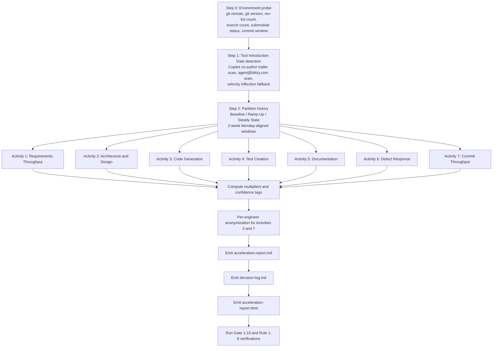

# Technical Specification

# 0. Agent Action Plan

## 0.1 Intent Clarification

### 0.1.1 Core Documentation Objective

Based on the provided requirements, the Blitzy platform understands that the documentation objective is to **mine the current repository's git history in read-only mode and produce a quantitative, factual-neutral technical report named `acceleration-report.md` that measures development acceleration across exactly 7 engineering activities by comparing a before-AI baseline against an after-AI period, with every numeric value traceable to a specific git command, every metric tagged with a confidence level, and every section conforming to a rigid 10-part structure and 10 quality gates**.

- **Request categorization**: Create new documentation — a single, self-contained analytical report derived entirely from git history of the `Blitzy-Sandbox/blitzy-jenkins` repository
- **Documentation type**: Technical/analytical report (mixed-format Markdown with embedded tables, confidence-tagged metrics, and a reproducibility appendix of git commands); supplemented by a Markdown decision log and a self-contained reveal.js executive presentation per user-specified project rules
- **Output surface**: Three new files at the repository root — `acceleration-report.md` (primary deliverable), a Markdown decision log (per the "Explainability" rule), and a single-file reveal.js HTML presentation (per the "Executive Presentation" rule)

Each documentation requirement restated with enhanced clarity:

- **Quantify acceleration for 7 fixed activities**: Requirements Throughput (feature branches / 2-week window), Architecture & Design (design docs / quarter), Code Generation (PRs merged / 2-week window), Test Creation (test files + functions / 2-week window), Documentation (doc files / quarter), Defect Response (fix-commit ratio), Commit Throughput (commits / engineer / 2-week window). No additional activities may be introduced; each activity that lacks sufficient git signal must be rendered literally as `Insufficient signal — [specific reason]`
- **Establish a single Tool Introduction Date**: Detect via the earliest `Co-authored-by:` trailer referencing an AI tool OR the sharpest sustained inflection in commit velocity; document detection method and exact ISO-8601 date; this date partitions the entire history into a Baseline period and an After period
- **Segment the After period into temporal phases**: Ramp-Up = first 90 days post-introduction; Steady State = day 91 onward. If fewer than 90 days of post-introduction data exist, collapse to Baseline vs. Post-Introduction only
- **Align every windowed metric to Monday-starting 2-week buckets**: Identical window alignment before and after the Tool Introduction Date
- **Tag every metric with High / Medium / Low confidence**: High = direct git measurement (counted objects); Medium = heuristic pattern match (branch naming, commit message scanning); Low = indirect proxy (e.g., doc creation as proxy for design activity). Medium and Low metrics must include boundary-condition documentation
- **Anonymize per-engineer views**: Engineers rendered as Engineer A, B, C… for Activities 3 (Code Generation) and 7 (Commit Throughput) only
- **Enforce strict factual-neutral tone**: Zero subjective qualifiers (impressive, significant, excellent, remarkable, unfortunately) in the report body, verifiable by grep
- **Produce full reproducibility**: Every numeric value must trace Requirement → Extraction Command → Raw Output → Derived Value → Reported Number, recorded in both the Requirements Traceability Matrix and the Reproducibility Appendix with zero orphan requirements or orphan results
- **Respect read-only boundary**: No repository modifications, no CI/CD access, no issue-tracker access, no external system access; derivation strictly from `git log`, `git rev-list`, `git branch`, `git show`, `git shortlog`, and equivalent read-only plumbing commands

Implicit documentation needs surfaced through analysis:

- **Environment Verification section precedes all metrics**: Repository URL, git version, total commit count, active branch count, submodule count and state, commit history date range, and extraction timestamp must be captured and rendered before any Activity Deep-Dive
- **Per-activity boundary-condition callouts**: Medium and Low confidence metrics require explicit false-positive / false-negative discussion (e.g., "branch naming convention detection misses branches that do not match `feature/*`, `feat/*`, or equivalent prefixes")
- **Confounding-factor disclosure**: Team size changes, repository creation dates, migration events, and bot activity (renovate, dependabot, github-actions, jenkins-release-bot) must be documented as potential baseline-validity threats
- **Bot and automation filtering**: Commits authored by known bots (`renovate[bot]`, `dependabot[bot]`, `github-actions[bot]`, `jenkins-release-bot`) must be either excluded or called out explicitly in Activities 3, 6, and 7 to prevent inflated signals
- **Merge-commit handling rules**: Activity 3 (Code Generation) measures merge commits; Activity 7 (Commit Throughput) measures non-merge commits; identical definitions must apply to before and after periods
- **Decision log as single source of truth for rationale**: Per the user's "Explainability" rule, every non-trivial implementation choice (e.g., tool-introduction detection method, 2-week window alignment choice, bot filtering inclusion/exclusion) must be recorded in a Markdown decision log table, not in narrative prose and not in code comments
- **Executive reveal.js presentation**: Per the user's "Executive Presentation" rule, a single self-contained HTML file (12–18 slides, 16 target) with the Blitzy visual identity must accompany the report to communicate the quantified findings to non-technical leadership

### 0.1.2 Special Instructions and Constraints

The user's prompt carries a dense set of directives that must be preserved verbatim in the final report and enforced during its generation. The following constraints are non-negotiable:

- **"MUST NOT fabricate, estimate, or extrapolate values"** — Every Insufficient-signal case must render the literal string `Insufficient signal — [specific reason]` and be recorded as a deviation with a traceability break point
- **"MUST use zero subjective qualifiers"** — Rule 3 explicitly prohibits terms such as *impressive*, *significant*, *excellent*, *remarkable*, *unfortunately* in the report body; verification is a grep pass over the generated file
- **"MUST tag every derived metric with a confidence level"** — Rule 4 requires a High/Medium/Low tag on every metric in the Executive Summary and all Activity Deep-Dives
- **"MUST apply identical methodology and time-window alignment to before and after periods"** — Rule 5 requires that before and after derivation commands be structurally identical except for the date range parameter
- **"MUST include a Reproducibility Appendix with the complete set of git commands"** — Rule 6 requires every command to be syntactically valid, reference only the target repository, and be ordered sequentially to match the Traceability Matrix
- **"Environment Verification MUST precede any Activity Deep-Dive"** — Rule 7 requires the section to be present, complete, and timestamped
- **"Metric values MUST NOT appear differently across sections"** — Rule 8 requires internal consistency between Executive Summary, Activity Deep-Dives, Traceability Matrix, and Acceleration Curve table, verifiable by spot-check

Exact activity catalog preserved from the user's prompt:

> **User-Provided Activity Table:**
>
> | # | Activity | Measure | Derivation Approach |
> | --- | --- | --- | --- |
> | 1 | Requirements Throughput | Feature branches / 2-week window | Count feature branches per 2-week window by naming convention or >=3-commit branches merged to main |
> | 2 | Architecture & Design | Design docs created / quarter | Count ARCHITECTURE.md, tech-spec*, adr-, design- via git log --diff-filter=A |
> | 3 | Code Generation | PRs merged / 2-week window | Merge commits per 2-week window, segmented by author |
> | 4 | Test Creation | Test files + functions / 2-week window | git log --diff-filter=A -- "**/test_*" "**/*_test.*" "**/*.test.*" "**/*.spec.*" |
> | 5 | Documentation | Doc files created / quarter | Net new .md, .mdx, .rst, .adoc via git log --diff-filter=A |
> | 6 | Defect Response | Fix commits / total ratio | Scan for fix, bugfix, hotfix, revert in commit messages |
> | 7 | Commit Throughput | Commits / engineer / 2-week window | Non-merge commits per active engineer (>=1 non-merge commit in window), normalizes for team growth |

Exact temporal-phase definitions preserved from the user's prompt:

> **User-Provided Temporal Phases:**
>
> | Phase | Definition |
> | --- | --- |
> | Baseline | Before Tool Introduction Date — unaccelerated velocity |
> | Ramp-Up | First 90 days post-introduction — onboarding, mixed signals expected |
> | Steady State | 90+ days post-introduction — stabilized acceleration |

Exact confidence classification preserved from the user's prompt:

> **User-Provided Signal Confidence Classification:**
>
> | Confidence | Definition | Derivation Type |
> | --- | --- | --- |
> | High | Direct git measurement | Counted objects (commits, files, branches) |
> | Medium | Heuristic pattern match | Pattern detection (branch naming, commit message scanning) |
> | Low | Indirect proxy | Inferred relationships (doc creation as proxy for design activity) |

Out-of-scope activities explicitly called out by the user and preserved verbatim:

> **User-Specified Out of Scope:** planning velocity, CI/CD speed, code review turnaround, runtime performance, customer-reported defects.

Web-search requirements: None mandated by the user. The report is derived exclusively from read-only git history of the target repository; no external research is required or permitted.

### 0.1.3 Technical Interpretation

These documentation requirements translate to the following technical documentation strategy:

- **To quantify per-activity acceleration**, produce seven Activity Deep-Dive sub-sections inside `acceleration-report.md`, each containing the baseline count, post-introduction count, multiplier (after / before ratio), confidence tag, boundary conditions (if Medium or Low), and factual-neutral interpretation
- **To anchor every numeric value in evidence**, populate a Reproducibility Appendix with sequentially ordered git commands covering environment probes, tool-introduction detection, and per-activity extraction; pair this with a Requirements Traceability Matrix row for each metric linking Requirement → Extraction Command → Derived Value → Status → Deviation Reference
- **To enforce factual-neutral tone**, restrict the report body to declarative, quantitative language; implement a verification step using `grep -iE 'impressive|significant|excellent|remarkable|unfortunately' acceleration-report.md` that must return zero matches
- **To separate temporal phases**, compute per-activity values in three adjacent time partitions — Baseline (before Tool Introduction), Ramp-Up (days 1–90 after), Steady State (day 91+) — using identical 2-week Monday-aligned buckets throughout
- **To detect the Tool Introduction Date**, scan `git log --all --format='%B'` for the earliest `Co-authored-by:` trailer matching known AI tool identifiers (`Copilot`, `Claude`, `Cursor`, `Windsurf`, `Cody`, `blitzy`, `anthropic`, `openai`), plus author-email scanning for `@blitzy.com` and `[bot]@users.noreply.github.com` patterns tied to AI coauthoring; if no such signal exists, fall back to inflection-point detection on monthly commit velocity. Document the detection method and the exact ISO-8601 date in the Methodology section
- **To preserve user rules**, capture all 8 rules from the user's prompt in a dedicated Rules sub-section within the report, each with its own verification criterion and scope statement
- **To comply with the Explainability project rule**, emit a Markdown decision log table alongside `acceleration-report.md` capturing every non-trivial choice (tool-introduction detection method, bot-filtering strategy, 2-week window alignment, merge-commit handling, inflection-detection thresholds) with columns: *Decision*, *Alternatives Considered*, *Rationale*, *Risks*
- **To comply with the Executive Presentation project rule**, emit a single self-contained reveal.js HTML file with 12–18 slides covering scope, headline multipliers, acceleration curve, confidence distribution, risks, and next steps, using the mandated Blitzy visual identity (color palette, typography, Mermaid theme) and CDN-pinned reveal.js 5.1.0, Mermaid 11.4.0, Lucide 0.460.0

### 0.1.4 Inferred Documentation Needs

The following needs are inferred from the user's prompt combined with repository evidence and must be addressed even though they are not explicitly listed as deliverables:

- **Based on repository reconnaissance**: The repository `Blitzy-Sandbox/blitzy-jenkins` contains 38,115 commits spanning 2006-11-05 through 2026-04-06 with 4 active branches and no submodules. A pre-check that validates `git` availability, version, and repository integrity must execute before any metric extraction to satisfy Rule 7 (Environment Verification Before Extraction)
- **Based on author-surface analysis**: The repository's active authors include automation bots (`renovate[bot]`, `dependabot[bot]`, `github-actions[bot]`, `jenkins-release-bot`) whose commit cadence is unrelated to human productivity. Activities 3 (Code Generation), 6 (Defect Response), and 7 (Commit Throughput) must either exclude these authors or explicitly document their inclusion; the decision log must record this rationale
- **Based on AI-signal reconnaissance**: The repository exhibits at least two candidate AI signals — `Co-authored-by: Copilot <175728472+Copilot@users.noreply.github.com>` trailers beginning 2025-06-19 and direct commits by `agent@blitzy.com` (Blitzy Agent, 154 commits) beginning 2026-02-19. The report must disambiguate which signal anchors the Tool Introduction Date and justify the choice, since the two signals produce materially different Baseline/After windows
- **Based on activity-specific heuristic brittleness**: Activity 1 (Requirements Throughput) depends on feature-branch naming conventions; if the repository lacks a consistent prefix (e.g., `feature/`, `feat/`, `JENKINS-`), the heuristic must fall back to the "merged branches with ≥3 commits" rule and boundary conditions must be documented
- **Based on documentation-file taxonomy**: Activity 2 (Architecture & Design) counts only files matching `ARCHITECTURE.md`, `tech-spec*`, `adr-*`, `design-*`; Activity 5 (Documentation) counts `.md`, `.mdx`, `.rst`, `.adoc`. The report must render a literal `Insufficient signal — [specific reason]` when either category returns zero matches rather than substituting a proxy metric
- **Based on the "normalizes for team growth" clause**: Activity 7 must implement per-2-week-window active-engineer computation (engineer with ≥1 non-merge commit in the window) before dividing total non-merge commits by the count, preserving identical logic in Baseline and After periods
- **Based on per-engineer anonymization**: Quality Gate 5 mandates an anonymized per-engineer breakdown for Activities 3 and 7; the mapping from real author identities to Engineer A/B/C… must be stable across the report and must be produced deterministically (e.g., sorted by total non-merge-commit volume descending) to support reproducibility
- **Based on the user's two project-level rules** ("Explainability" and "Executive Presentation"): The final deliverable set is three files, not one — the report, the decision log, and the presentation — all of which must be internally consistent per Rule 8 (Internal Consistency)

## 0.2 Documentation Discovery and Analysis

### 0.2.1 Existing Documentation Infrastructure Assessment

Repository analysis reveals a modest but structured documentation surface in a state of active evolution, with coverage concentrated on project-level narrative and migration mechanics rather than quantitative git-derived analytics. The table below inventories the documentation assets that already exist and that the new report must coexist with without disruption.

| Path | Format | Role | Status |
|------|--------|------|--------|
| `README.md` | Markdown | Project introduction, downloads, development, governance, licensing | Existing, unchanged by this task |
| `CONTRIBUTING.md` | Markdown | Onboarding, builds, debugging, linting, testing, PR workflow | Existing, unchanged by this task |
| `docs/index.md` | Markdown | MkDocs landing page | Existing, unchanged by this task |
| `docs/project-guide.md` | Markdown | Long-form migration narrative (executive summary, hours breakdown, risk) | Existing, unchanged by this task |
| `docs/technical-specifications.md` | Markdown | Master technical contract for the React 19 + TypeScript + Vite 7 migration | Existing, unchanged by this task |
| `docs/MAINTAINERS.adoc` | Asciidoc | Maintainer policy and governance | Existing, unchanged by this task |
| `mkdocs.yml` | YAML | MkDocs site configuration; uses `techdocs-core` and `mermaid2` plugins | Existing, unchanged by this task |
| `catalog-info.yaml` | YAML | Backstage component metadata; registers repository as `blitzy-jenkins`, system `blitzy-java`, owner `blitzy-sandbox` | Existing, unchanged by this task |

Documentation framework and tooling context:

- **Primary documentation framework**: MkDocs with the Backstage `techdocs-core` plugin, confirmed by `mkdocs.yml` lines 6–8 and `catalog-info.yaml` line 13 (`backstage.io/techdocs-ref: dir:.`)
- **Diagram tooling**: Mermaid via the `mermaid2` MkDocs plugin, confirmed by `mkdocs.yml` line 8 and present in `docs/project-guide.md` (pie chart embedded at lines 13–17) and `docs/technical-specifications.md` (flowchart embedded at lines 38–60)
- **Asciidoc support**: Not part of the current MkDocs build; `docs/MAINTAINERS.adoc` is referenced outside the rendered docs site
- **Documentation hosting**: Backstage TechDocs via the catalog component registration at `github.com/project-slug: Blitzy-Sandbox/blitzy-jenkins`
- **API documentation tooling**: No JSDoc, TypeDoc, Sphinx, or Javadoc generation is active in the current docs pipeline (confirmed by absence of corresponding config files and by `package.json` script list, which exposes only build/lint commands)
- **Documentation-generator config files present**: `mkdocs.yml` (single)

Search patterns employed during discovery and their outcomes:

- `find . -name "*.md" -type f` (outside `node_modules` and `.git`) identified 8 Markdown files total — the 4 docs files listed above plus `.github/PULL_REQUEST_TEMPLATE.md`, `core/src/main/resources/META-INF/upgrade/README.md`, `core/src/site/markdown/index.md`, and `test/src/test/java/test/README.md`
- `find . -name "*.adoc"` surfaced only `docs/MAINTAINERS.adoc`
- `find . -name "*.rst" -o -name "*.mdx"` returned zero matches
- No `ARCHITECTURE.md`, `adr-*`, `design-*`, or `tech-spec*` files exist at the repository root or under standard locations (`docs/`, `doc/`, `architecture/`, `adr/`), confirming that Activity 2 (Architecture & Design Docs) is likely to yield `Insufficient signal` unless the more permissive file pattern `docs/technical-specifications.md` is included by the heuristic; the decision log must record which interpretation is used

### 0.2.2 Repository Code Analysis for Documentation

The documentation to be produced is derived from git history rather than source code. Accordingly, the "code analysis for documentation" step maps to a git-history reconnaissance pass. The following inventory summarizes the facts extracted from the repository and that must be reflected identically in the generated report's Environment Verification section:

| Git Fact | Command | Value (as of reconnaissance) |
|----------|---------|-------------------------------|
| Repository URL | `git remote get-url origin` | `https://github.com/Blitzy-Sandbox/blitzy-jenkins.git` |
| Git version | `git --version` | `git version 2.43.0` |
| Total commit count | `git rev-list --all --count` | `38115` |
| Earliest commit | `git log --reverse --format='%aI %H' \| head -1` | `2006-11-05T21:16:01+00:00` (hash `8a0dc230f44e84e5a7f7920cf9a31f09a54999ac`) |
| Latest commit | `git log -1 --format='%aI %H'` | `2026-04-06T23:09:56-04:00` (hash `6f653dffd77a9a8fe250fb7ec75e39156366aab3`) |
| Active branch count | `git branch -a \| wc -l` | `4` |
| Submodule state | `git submodule status` | `(empty — no submodules present)` |
| Earliest `Co-authored-by: Copilot` trailer | `git log --all --format='%aI %H %s' --grep='Co-authored-by: Copilot' \| tail -1` | `2025-06-19T11:03:50+01:00` (`c701361ec7bc9aa58d7745de6291a01b3d7abbe4`, "Fix Typo") |
| Earliest `agent@blitzy.com` commit | `git log --all --author='agent@blitzy.com' --format='%aI %H %s' \| tail -1` | `2026-02-19T10:42:03+00:00` (`f0f89db8ec0ef59109dc496e6cbbf8a5439032ab`) |
| Total `agent@blitzy.com` commits | `git log --all --author='agent@blitzy.com' --oneline \| wc -l` | `154` |
| Total `Co-authored-by: Copilot` commits | `git log --all --grep='Co-authored-by: Copilot' \| grep '^commit' \| wc -l` | `5` |

The values above MUST appear verbatim in the report's Environment Verification section; any divergence between reconnaissance and the extraction run at report-generation time must itself be noted as a deviation.

Key directories and file taxonomies examined:

- Root: `README.md`, `CONTRIBUTING.md`, `LICENSE.txt`, `mkdocs.yml`, `catalog-info.yaml`, `package.json`, `pom.xml`
- `docs/`: `index.md`, `project-guide.md`, `technical-specifications.md`, `MAINTAINERS.adoc`
- `.github/`: `PULL_REQUEST_TEMPLATE.md` (relevant for PR heuristics in Activity 3), plus workflow files
- `core/`, `cli/`, `websocket/`, `war/`, `test/`, `bom/`, `coverage/`: Maven modules whose commit activity feeds all seven per-activity counts
- `src/`: Frontend JavaScript, SCSS, and Checkstyle configuration whose modification contributes to Commit Throughput
- Test-file scopes used by Activity 4: patterns `**/test_*`, `**/*_test.*`, `**/*.test.*`, `**/*.spec.*` — under `core/src/test/`, `cli/src/test/`, `test/src/test/`, `war/src/test/`, `websocket/*/src/test/`

Authors and bots catalogued for filtering decisions in Activities 3, 6, and 7:

- Automation accounts (candidates for exclusion): `renovate[bot]@users.noreply.github.com`, `dependabot[bot]@users.noreply.github.com`, `github-actions[bot]@users.noreply.github.com`, `jenkins-release-bot@users.noreply.github.com`
- AI-related author identities: `agent@blitzy.com` (Blitzy Agent), `Copilot <175728472+Copilot@users.noreply.github.com>` (via co-author trailer)
- Blitzy human contributor: `michael@blitzy.com` (Michael Montanaro)

### 0.2.3 Web Search Research Conducted

No external web search is mandated by the user's prompt, and the report must be derivable exclusively from the target repository's git history per the "No authority to access external systems" boundary. No web-search findings are incorporated.

The single, narrow exception is the reveal.js executive presentation deliverable governed by the user's "Executive Presentation" project rule, which specifies exact CDN-pinned versions (reveal.js 5.1.0, Mermaid 11.4.0, Lucide 0.460.0) and Google Fonts (`Inter`, `Space Grotesk`, `Fira Code`); these versions are user-declared and require no independent verification.

## 0.3 Documentation Scope Analysis

### 0.3.1 Git-History-to-Documentation Mapping

The analytical report has no source code to document; its "source" is the repository's own git history. The following mapping enumerates each git-derived signal and the report section or file that it feeds. Every signal is paired with its canonical extraction command, its assigned confidence level, and the activity or section it serves.

| Git Signal | Extraction Command (canonical form) | Confidence | Feeds Report Section |
|------------|---------------------------------------|------------|------------------------|
| Repository environment metadata | `git remote get-url origin` · `git --version` · `git rev-list --all --count` · `git branch -a` · `git submodule status` | High | Section 2: Environment Verification |
| Tool Introduction Date — primary signal | `git log --all --format='%aI %H' --grep='Co-authored-by:' \| grep -iE 'Copilot\|Claude\|Cursor\|Windsurf\|Cody\|blitzy\|anthropic\|openai' \| tail -1` | Medium | Section 3: Methodology |
| Tool Introduction Date — fallback signal | Inflection detection on `git log --all --format='%aI' \| awk -F'T' '{print $1}' \| awk -F'-' '{print $1"-"$2}' \| sort \| uniq -c` | Low | Section 3: Methodology |
| Activity 1 — Requirements Throughput (primary) | `git for-each-ref --format='%(refname:short) %(objectname)' refs/heads \| grep -E '^(feature\|feat)/'` counted per 2-week window | Medium | Section 4: Activity 1 |
| Activity 1 — Requirements Throughput (fallback) | Merged branches with ≥3 commits per 2-week window via `git log --merges --first-parent main --format='%aI %s'` and commit-count filtering | Medium | Section 4: Activity 1 |
| Activity 2 — Architecture & Design docs | `git log --diff-filter=A --format='%aI %H' -- '**/ARCHITECTURE.md' '**/tech-spec*' '**/adr-*' '**/design-*'` per quarter | High | Section 4: Activity 2 |
| Activity 3 — PRs merged | `git log --merges --first-parent main --format='%aI %an %ae %s'` per 2-week window, per author | High | Section 4: Activity 3 |
| Activity 4 — Test files created | `git log --diff-filter=A --format='%aI %H' -- '**/test_*' '**/*_test.*' '**/*.test.*' '**/*.spec.*'` per 2-week window | High | Section 4: Activity 4 |
| Activity 4 — Test functions (supplementary) | Per-commit diff scan for added test functions (`git show --stat` + language-specific test-declaration pattern) | Medium | Section 4: Activity 4 |
| Activity 5 — Documentation files created | `git log --diff-filter=A --format='%aI %H' -- '*.md' '*.mdx' '*.rst' '*.adoc'` per quarter | High | Section 4: Activity 5 |
| Activity 6 — Defect Response ratio | `git log --all --format='%aI %s' \| grep -iE '\\b(fix\|bugfix\|hotfix\|revert)\\b'` divided by total commits per period | Medium | Section 4: Activity 6 |
| Activity 7 — Commit Throughput per engineer | `git log --no-merges --format='%aI %ae'` grouped by 2-week window and email | High | Section 4: Activity 7 |
| Per-engineer breakdown for Activities 3 and 7 | `git shortlog -sne --no-merges` filtered to author-commit-volume ≥ threshold, anonymized A/B/C… | High | Section 6: Per-Engineer Acceleration |
| Acceleration curve (Baseline → Ramp-Up → Steady State) | Same commands above, partitioned by Tool Introduction Date and day-90 boundary | Inherits per-activity confidence | Section 7: Acceleration Curve |

Configuration-facing documentation: Not applicable. The deliverable does not modify `mkdocs.yml`, `catalog-info.yaml`, or any other configuration file; the report is produced as standalone files at the repository root.

Feature-guide documentation: Not applicable. The deliverable is a retrospective analytical report, not a user-facing feature guide.

### 0.3.2 Documentation Gap Analysis

Given the requirements and repository analysis, documentation gaps that this task fills include the following:

- **Quantified productivity baseline**: No existing documentation in the repository quantifies pre-AI versus post-AI development velocity. The 7-activity breakdown introduced by this task is net new
- **Tool Introduction Date attribution**: No artifact currently identifies when AI co-authoring began in the repository's timeline. The tool-introduction detection method and exact date are net new
- **Reproducibility appendix for git-derived metrics**: Neither `docs/project-guide.md` nor `docs/technical-specifications.md` contains extraction-command provenance for any quantitative claim. The Reproducibility Appendix is net new
- **Per-engineer anonymized view**: No existing artifact anonymizes contributor activity. The Engineer A/B/C… mapping for Activities 3 and 7 is net new
- **Temporal phase framework**: No existing artifact partitions repository history into Baseline / Ramp-Up / Steady State. The phase definitions and acceleration-curve table are net new
- **Confidence-tagged metric presentation**: No existing artifact attaches High/Medium/Low confidence to its figures. Confidence tagging is net new
- **Factual-neutral analytical tone**: The existing `docs/project-guide.md` uses evaluative language (e.g., checkmark emojis, "key accomplishments"). The new report deliberately excludes evaluative tone and is the repository's first factual-neutral analytical deliverable

Gaps that this task explicitly does not fill (out-of-scope per user's boundaries):

- Planning velocity, CI/CD speed, code review turnaround, runtime performance metrics, customer-reported defect counts — the user's prompt excludes these
- Narrative justification of *why* AI acceleration occurred — the report is factual-neutral; attribution of causes is excluded
- Recommendations or prescriptive guidance — Rule 3 prohibits evaluative language and the validation framework omits a "Recommendations" section

Outdated documentation: None. `README.md`, `CONTRIBUTING.md`, `docs/index.md`, `docs/project-guide.md`, `docs/technical-specifications.md`, and `docs/MAINTAINERS.adoc` remain unchanged.

## 0.4 Documentation Implementation Design

### 0.4.1 Documentation Structure Planning

The primary deliverable `acceleration-report.md` must follow the exact 10-section structure mandated by the user's Validation Framework. Every section is required, ordered, and subject to one or more quality gates. The following hierarchy is canonical and must not be rearranged:

```
acceleration-report.md
├── 1. Executive Summary
│   ├── Headline multipliers (strongest first)
│   ├── Confidence tags on every figure
│   └── Cross-reference to Activity Deep-Dive for each figure
├── 2. Environment Verification
│   ├── Repository URL
│   ├── Git version
│   ├── Commit window (first → last ISO-8601)
│   ├── Submodule state
│   ├── Extraction timestamp (ISO-8601, UTC)
│   ├── Active branch count
│   └── Total commit count
├── 3. Methodology
│   ├── Tool Introduction Date detection (method + date)
│   ├── Per-activity extraction approach
│   ├── Confidence rationale per activity
│   ├── Temporal segmentation design (Baseline / Ramp-Up / Steady State)
│   ├── 2-week window alignment (Monday-start)
│   └── Known biases and confounders
├── 4. Activity Deep-Dives (one sub-section per activity, 7 total)
│   ├── 4.1 Requirements Throughput
│   ├── 4.2 Architecture & Design
│   ├── 4.3 Code Generation
│   ├── 4.4 Test Creation
│   ├── 4.5 Documentation
│   ├── 4.6 Defect Response
│   └── 4.7 Commit Throughput
│     Each deep-dive contains: Baseline value, After-period value,
│     Multiplier, Confidence tag, Boundary conditions (Medium/Low only),
│     Interpretation (factual-neutral)
├── 5. Requirements Traceability Matrix
│   └── One row per metric: Requirement → Extraction Command → Derived Value → Status → Deviation Ref
├── 6. Per-Engineer Acceleration
│   ├── Activity 3 (Code Generation): range and median, Engineers A/B/C…
│   └── Activity 7 (Commit Throughput): range and median, Engineers A/B/C…
├── 7. Acceleration Curve
│   └── Table: Baseline → Ramp-Up → Steady State, one column per activity
├── 8. Risk Assessment
│   ├── Low-confidence activities (with severity)
│   ├── Insufficient-signal gaps
│   └── Confounding factors (severity classification)
├── 9. Limitations
│   ├── Data gaps
│   ├── Proxy limitations
│   └── What this analysis cannot determine
└── 10. Reproducibility Appendix
    └── All git commands, ordered sequentially, matching Traceability Matrix order
```

Companion deliverables required by user project rules:

- **`decision-log.md`** (per "Explainability" rule): Markdown table at repository root (or under `docs/`) capturing every non-trivial choice with columns *Decision*, *Alternatives Considered*, *Why This Choice*, *Risks*. Rationale is forbidden in code comments; the decision log is the single source of truth for *why*
- **`acceleration-report.html`** (per "Executive Presentation" rule): Single self-contained reveal.js HTML file, 12–18 slides (target 16), with CDN-pinned reveal.js 5.1.0, Mermaid 11.4.0, Lucide 0.460.0; Blitzy brand palette, typography, slide types (Title/Divider/Content/Closing), and all mandated CSS custom properties embedded inline

### 0.4.2 Content Generation Strategy

Information extraction approach:

- **Environment probes**: Execute the exact commands listed in the Environment Verification mapping and transcribe raw outputs into the report verbatim; attach an ISO-8601 `--extraction-timestamp` captured by `date --iso-8601=seconds --utc`
- **Tool Introduction Date detection**: Apply the primary signal (earliest AI `Co-authored-by:` trailer) as default; fall back to inflection detection only if primary signal returns zero matches; record the decision in `decision-log.md`
- **Per-activity extraction**: For each of the 7 activities, execute the canonical command documented in Section 0.3.1 twice — once with `--before=<Tool Introduction Date>` and once with `--after=<Tool Introduction Date>` — and compute multipliers as `after / before`, rendering `Insufficient signal — [specific reason]` when the before or after count is zero or undefined
- **Per-engineer anonymization**: Generate a stable Engineer-ID map by sorting active human authors (bots excluded) by total non-merge commit volume descending; assign Engineer A to the highest-volume author, Engineer B to the next, etc. Persist this mapping in the decision log so the same IDs can be regenerated deterministically

Template application strategy:

- The user did not provide a `acceleration-report.md` template. The 10-section structure specified in the user's Validation Framework serves as the de-facto template and must be applied without deviation
- Each Activity Deep-Dive sub-section must use an identical internal skeleton: `Baseline`, `After / Post-Introduction`, `Multiplier`, `Confidence`, `Boundary Conditions` (Medium/Low only), `Interpretation`
- The Requirements Traceability Matrix must use a fixed column schema: `Requirement ID`, `Requirement`, `Extraction Command`, `Derived Value`, `Status`, `Deviation Reference`

Documentation standards applied:

- Markdown with GitHub Flavored Markdown extensions (tables, task lists, fenced code blocks)
- Fenced code blocks for all shell commands: ```` ```bash ... ``` ````
- Mermaid diagrams via ```` ```mermaid ... ``` ```` blocks where required (Acceleration Curve visual, optional in report body; required in reveal.js slides per Executive Presentation rule)
- Source citations as literal git commands in the Reproducibility Appendix, not as footnotes
- Table-based presentation for every multi-value artifact (per-activity counts, per-engineer breakdown, Traceability Matrix, confounders)
- Consistent terminology: "Tool Introduction Date" (never "AI onboarding date" or similar variants); "Baseline" / "Ramp-Up" / "Steady State" (exact casing); "Activity N" (arabic numerals, matching the user's Activities 1–7)
- Factual-neutral language throughout the report body (verified by grep of subjective qualifiers)

### 0.4.3 Diagram and Visual Strategy

Mermaid diagrams to produce:

- **Acceleration Curve bar chart** (optional in `acceleration-report.md`, required in `acceleration-report.html`): Renders per-activity multipliers side-by-side across Baseline / Ramp-Up / Steady State, implemented as a Mermaid `xychart-beta` or a styled HTML/Markdown table depending on Mermaid 11.4.0 feature availability
- **Commit velocity timeline** (reveal.js only): Line chart showing monthly non-merge commit counts with a vertical marker at the Tool Introduction Date
- **Activity-to-Confidence matrix** (reveal.js only): Mermaid `quadrantChart` or static table mapping each of the 7 activities to its confidence tier
- **Methodology flow** (reveal.js only): Mermaid `flowchart LR` showing Raw Git History → Extraction Commands → Per-Activity Values → Multipliers → Confidence Tags → Report Sections

Reveal.js visual specifications (from user project rule, preserved exactly):

- **Slide count**: 12–18 total, target 16
- **Slide types**: Title (`slide-title`), Section Divider (`slide-divider`), Content (default), Closing (`slide-closing`)
- **Every slide must include at least one non-text visual element** (Mermaid diagram, KPI card, styled table, or Lucide SVG icon)
- **Content slides**: max 4 bullets, max 40 words of body text, min 1 non-text visual
- **Zero emoji**; Lucide SVG icons only via `<i data-lucide="icon-name"></i>`
- **No fenced code blocks inside slides**; inline Fira Code for short expressions only
- **Color palette**: `#5B39F3` (primary), `#2D1C77` (dark), `#94FAD5` (teal accent), `#1A105F` (navy), gradient `#7A6DEC`→`#5B39F3`→`#4101DB`, neutrals `#333333`, `#999999`, `#D9D9D9`, `#F4EFF6`, `#F5F5F5`, `#FFFFFF`
- **Typography**: Inter (body 400/500/600/700), Space Grotesk (display headings 500/600/700), Fira Code (mono/eyebrows 400/500) via Google Fonts `<link>`
- **Title slide**: hero gradient `linear-gradient(68deg, #7A6DEC 15.56%, #5B39F3 62.74%, #4101DB 84.44%)`, white text, eyebrow in Fira Code teal
- **Dividers**: dark purple `#2D1C77` or gradient background, large centered heading, thematic Lucide icon
- **Closing slide**: navy `#1A105F` background, 3–6 word takeaway heading, max 3 bullets, brand lockup, gradient accent bar
- **Mermaid integration**: embed as `<pre class="mermaid">` with raw syntax; initialize with `startOnLoad: false`; call `mermaid.run()` after reveal.js `ready` and on every `slidechanged`
- **Mermaid theme variables**: `primaryColor: '#F2F0FE'`, `primaryTextColor: '#333333'`, `primaryBorderColor: '#5B39F3'`, `lineColor: '#999999'`, `secondaryColor: '#F4EFF6'`
- **reveal.js config**: `hash: true`, `transition: 'slide'`, `controlsTutorial: false`, `width: 1920`, `height: 1080`
- **Lucide initialization**: call `lucide.createIcons()` after `ready` and on every `slidechanged`
- **CSS custom properties** (inline): full `--blitzy-*`, `--ff-*`, and `--gradient-*` set per the canonical theme

Image and screenshot requirements: None. The report is derived entirely from text-mode git output; no screenshots are captured or embedded.

## 0.5 Documentation File Transformation Mapping

### 0.5.1 File-by-File Documentation Plan

Every file created, updated, or referenced during this task is enumerated exhaustively below with its transformation mode. No files are left as "pending" or "to be discovered."

Transformation modes:

- **CREATE** — Create a new documentation file
- **UPDATE** — Update an existing documentation file
- **DELETE** — Remove an obsolete documentation file
- **REFERENCE** — Use as an example for documentation style and structure only; no content modification

| Target Documentation File | Transformation | Source | Content / Changes |
|---------------------------|----------------|--------|--------------------|
| `acceleration-report.md` | CREATE | Git history of `Blitzy-Sandbox/blitzy-jenkins` (read-only `.git` directory) | Net-new analytical report containing the 10 mandated sections (Executive Summary, Environment Verification, Methodology, 7 Activity Deep-Dives, Traceability Matrix, Per-Engineer Acceleration, Acceleration Curve, Risk Assessment, Limitations, Reproducibility Appendix) with confidence-tagged figures for all 7 activities and a sequentially ordered command appendix |
| `decision-log.md` | CREATE | Methodology choices made during `acceleration-report.md` generation | Markdown table with columns *Decision*, *Alternatives Considered*, *Why This Choice*, *Risks* covering at minimum: Tool Introduction Date detection method, bot-filtering strategy, 2-week window alignment (Monday-start vs. other), merge-commit handling in Activity 3 vs. Activity 7, inflection-detection thresholds if fallback is used, per-engineer anonymization ordering rule, interpretation of Activity 2 file-pattern matching, handling of `Insufficient signal` cases. Includes a bidirectional traceability matrix mapping each decision to the report section(s) it affects |
| `acceleration-report.html` | CREATE | Distilled findings from `acceleration-report.md` | Single self-contained reveal.js 5.1.0 HTML file with 12–18 `<section>` slides (target 16), Blitzy visual identity inline CSS, embedded Mermaid 11.4.0 diagrams (`<pre class="mermaid">`), Lucide 0.460.0 SVG icons, CDN-pinned external resources only, no build step, no local file dependencies; content covers scope, headline multipliers, architecture diagram of extraction methodology, risks, and next-step onboarding |
| `docs/project-guide.md` | REFERENCE | Existing file at `docs/project-guide.md` | Used only as a style anchor for tabular Markdown presentation and Mermaid embedding conventions; NOT modified |
| `docs/technical-specifications.md` | REFERENCE | Existing file at `docs/technical-specifications.md` | Used only as a reference for technical-writing tone and table structures; NOT modified |
| `README.md` | REFERENCE | Existing file at root | Used only to confirm project identity for the Environment Verification section; NOT modified |
| `mkdocs.yml` | REFERENCE | Existing file at root | Inspected to confirm documentation framework; NOT modified. The new `acceleration-report.md` is emitted at repo root, outside `docs/`, so MkDocs navigation requires no update for this task |
| `catalog-info.yaml` | REFERENCE | Existing file at root | Inspected to confirm component identity (`Blitzy-Sandbox/blitzy-jenkins`) for the report's Environment Verification; NOT modified |

The mapping above is exhaustive. No additional documentation files will be created, updated, or deleted.

### 0.5.2 New Documentation Files Detail

**File: `acceleration-report.md`**

```
File: acceleration-report.md
Type: Analytical technical report (factual-neutral, quantitative)
Source: git history of the repository (read-only)
Sections:
    1. Executive Summary
        - Headline multiplier per activity, strongest result first
        - Confidence tag on every figure (High | Medium | Low)
        - Forward-link to each Activity Deep-Dive
    2. Environment Verification
        - Repository URL, git version, total commits, active branches,
          submodule state, commit window (ISO-8601), extraction timestamp
        - Must appear before any Activity Deep-Dive (Gate 3)
    3. Methodology
        - Tool Introduction Date detection method and exact date
        - Per-activity extraction approach (one paragraph per activity)
        - Confidence rationale per activity
        - Temporal segmentation (Baseline / Ramp-Up / Steady State) and
          2-week Monday-aligned window definition
        - Known biases and confounders (team size, bot activity, migration)
    4. Activity Deep-Dives
        4.1 Requirements Throughput (Medium confidence, boundary conditions required)
        4.2 Architecture & Design (High or Insufficient-signal per evidence)
        4.3 Code Generation (High confidence; anonymized per-author subtable)
        4.4 Test Creation (High confidence)
        4.5 Documentation (High confidence)
        4.6 Defect Response (Medium confidence, boundary conditions required)
        4.7 Commit Throughput (High confidence; anonymized per-engineer subtable)
    5. Requirements Traceability Matrix (every metric → command → value)
    6. Per-Engineer Acceleration (range and median, Activities 3 and 7 only)
    7. Acceleration Curve (table: Baseline → Ramp-Up → Steady State)
    8. Risk Assessment (Low-confidence activities, insufficient-signal gaps,
       confounding factors with severity classification)
    9. Limitations (data gaps, proxy limitations, what is not determinable)
    10. Reproducibility Appendix (all git commands, ordered sequentially)
Diagrams:
    - None required by default in the report body
    - Optional: acceleration-curve Mermaid bar chart if Mermaid 11.4.0
      is available in the render environment (TechDocs via mermaid2 plugin)
Key Citations:
    - Every numeric value must cite a Reproducibility Appendix command ID
    - Every Activity Deep-Dive must cite its matching Traceability Matrix row
Quality Gates (from user's Validation Framework):
    Gate 1: All 7 activities populated or marked Insufficient signal
    Gate 2: Zero numeric claims without appendix entry and traceability row
    Gate 3: Environment Verification complete and timestamped before
            first Activity Deep-Dive
    Gate 4: Confidence tags on all Executive Summary metrics
    Gate 5: Per-engineer anonymized view for Activities 3 and 7
    Gate 6: Temporal phases populated or justified N/A with reasoning
    Gate 7: Risk Assessment addresses all Low-confidence and
            insufficient-signal gaps
    Gate 8: Metric values identical across all sections
    Gate 9: Reproducibility Appendix commands syntactically valid,
            ordered sequentially
    Gate 10: Rules 1-8 pass with zero violations
```

**File: `decision-log.md`**

```
File: decision-log.md
Type: Markdown table (project-rule mandate: Explainability)
Source: Methodology choices made during acceleration-report.md generation
Sections:
    - Overview paragraph (≤ 3 sentences, factual)
    - Decision Table with columns:
        * ID (D001, D002, …)
        * Decision
        * Alternatives Considered
        * Why This Choice
        * Risks
    - Bidirectional Traceability Matrix with columns:
        * Decision ID → Report Section(s) Affected
        * Report Section → Decision IDs Applied
      Coverage must be 100%; no gaps
Required decision entries (minimum):
    D001: Tool Introduction Date detection method
          (Copilot co-author trailer vs. agent@blitzy.com commit
          vs. velocity inflection)
    D002: Bot author filtering
          (renovate[bot], dependabot[bot], github-actions[bot],
           jenkins-release-bot — include or exclude per activity)
    D003: 2-week window alignment (Monday-start per user prompt)
    D004: Merge-commit handling (included for Activity 3, excluded
          for Activity 7, per user prompt)
    D005: Activity 1 feature-branch heuristic
          (naming convention vs. >=3-commit merged branches)
    D006: Activity 2 file-pattern matching
          (literal ARCHITECTURE.md + tech-spec* + adr-* + design-*
          vs. broader technical-spec* glob)
    D007: Activity 6 fix-commit regex scope
          (full-message grep vs. subject-only grep; word boundaries)
    D008: Per-engineer anonymization ordering
          (stable by non-merge commit volume descending)
    D009: Insufficient-signal rendering
          (literal string format and traceability break point record)
    D010: Ramp-Up vs. Post-Introduction collapse
          (applied only if <90 days of post-introduction data)
Key Citations:
    - Every decision references the report section(s) it governs
    - Every risk references a mitigating section in the report
      (e.g., Limitations, Risk Assessment)
```

**File: `acceleration-report.html`**

```
File: acceleration-report.html
Type: Single self-contained reveal.js presentation
       (project-rule mandate: Executive Presentation)
Source: Distilled findings from acceleration-report.md
Slide Ordering Convention (per user project rule):
    1. Title Slide — project name, scope, audience framing
    2. Content — headline findings or KPI summary
    3. Content — methodology overview (Mermaid diagram)
    4-N. Alternating Section Dividers + Content for each major topic
          (one divider+content pair per activity cluster, one for
          per-engineer breakdown, one for risks, one for limitations)
    N+1. Closing Slide — key takeaway, next steps, brand lockup
CDN-Pinned Dependencies (per user project rule):
    - reveal.js 5.1.0 (hash: true, transition: 'slide',
      controlsTutorial: false, width: 1920, height: 1080)
    - Mermaid 11.4.0 (startOnLoad: false; mermaid.run() called
      after reveal.js ready and on every slidechanged event)
    - Lucide 0.460.0 (lucide.createIcons() called after
      reveal.js ready and on every slidechanged event)
    - Google Fonts link for Inter, Space Grotesk, Fira Code
Brand Tokens (inline CSS, per user project rule):
    - --blitzy-primary: #5B39F3
    - --blitzy-primary-dark: #2D1C77
    - --blitzy-primary-navy: #1A105F
    - --blitzy-accent-teal: #94FAD5
    - Full --blitzy-*, --ff-*, and --gradient-* custom properties
Slide Content Plan (16 slides, target):
     1. Title slide (hero gradient; eyebrow: acceleration report)
     2. What was done — scope (KPI cards)
     3. Methodology overview (Mermaid flowchart)
     4. Section divider: Per-Activity Results
     5. Activities 1-3 (KPI card grid with confidence badges)
     6. Activities 4-7 (KPI card grid with confidence badges)
     7. Section divider: Temporal Acceleration
     8. Acceleration curve (Mermaid xychart-beta or styled table)
     9. Section divider: Per-Engineer View
    10. Engineers A/B/C…: Activity 3 (anonymized styled table)
    11. Engineers A/B/C…: Activity 7 (anonymized styled table)
    12. Section divider: Confidence and Risk
    13. Confidence distribution across activities (Lucide icon row)
    14. Risks and confounders (styled table)
    15. Limitations (bulleted, max 4 items)
    16. Closing slide — next steps, brand lockup, gradient accent bar
Verification:
    - HTML file opens in a browser with no console errors
    - All Mermaid diagrams and Lucide icons render
    - <section> count is 12-18 (target 16)
    - Every <section> contains ≥ 1 non-text visual
```

### 0.5.3 Documentation Files to Update Detail

No existing documentation files are updated by this task. The report deliverables live at the repository root as standalone files. `README.md`, `CONTRIBUTING.md`, `docs/index.md`, `docs/project-guide.md`, `docs/technical-specifications.md`, `docs/MAINTAINERS.adoc`, `mkdocs.yml`, and `catalog-info.yaml` remain byte-identical.

### 0.5.4 Documentation Configuration Updates

No configuration updates are required:

- **`mkdocs.yml`**: Not modified. The navigation currently lists Home, Project Guide, and Technical Specifications. `acceleration-report.md` is emitted at the repository root and is intentionally outside the MkDocs-managed `docs/` folder; it does not need to appear in TechDocs navigation for this task
- **`catalog-info.yaml`**: Not modified. No new links, tags, or annotations are added
- **`package.json`**: Not modified. No new documentation build scripts are introduced
- **No `.readthedocs.yml` or `docusaurus.config.js` exists** in the repository, so no ReadTheDocs/Docusaurus configuration work applies

### 0.5.5 Cross-Documentation Dependencies

- **Internal consistency between `acceleration-report.md` and `acceleration-report.html`**: Rule 8 requires that every metric value appearing in both files be identical. The presentation content must be a projection of the report, never a re-derivation
- **Internal consistency between `acceleration-report.md` and `decision-log.md`**: Every decision in the log must cite at least one report section where it applies; every non-trivial methodological choice in the report must appear as a row in the log
- **Traceability Matrix ↔ Reproducibility Appendix**: The `Requirement ID` column of the Traceability Matrix and the sequential command order of the Reproducibility Appendix must align one-to-one, with Gate 9 verifying sequential ordering
- **Navigation links**: None. The three deliverables are flat files with no inter-file hyperlinks; cross-references use section names and row identifiers rather than URL fragments

## 0.6 Dependency Inventory

### 0.6.1 Runtime and Tooling Dependencies

The report is derived exclusively from read-only git history and from standard POSIX text-processing utilities already present in the execution environment. No new runtime installation is required for the primary report deliverable. The reveal.js executive presentation uses only CDN-hosted resources and requires no local build step.

| Registry | Package / Tool | Version | Purpose |
|----------|----------------|---------|---------|
| System (OS) | `git` | `2.43.0` (verified via `git --version`) | Read-only history mining: `log`, `rev-list`, `branch`, `show`, `shortlog`, `for-each-ref`, `submodule status` |
| System (OS) | `bash` | ≥ 4 (POSIX-compatible) | Command pipelines for extraction scripts in the Reproducibility Appendix |
| System (OS) | `awk`, `sed`, `grep`, `sort`, `uniq`, `wc`, `head`, `tail`, `cut`, `tr`, `date`, `python3` | Whatever is present on the system | Text processing and aggregation for per-window and per-author rollups |
| CDN (unpkg / jsdelivr) | `reveal.js` | `5.1.0` | Presentation runtime for `acceleration-report.html`; loaded via `<script src="...reveal.js@5.1.0...">` (per user "Executive Presentation" rule) |
| CDN (unpkg / jsdelivr) | `mermaid` | `11.4.0` | Diagram rendering inside presentation slides; loaded via `<script src="...mermaid@11.4.0...">` (per user "Executive Presentation" rule) |
| CDN (unpkg / jsdelivr) | `lucide` | `0.460.0` | Icon library for non-text visual elements; loaded via `<script src="...lucide@0.460.0...">` (per user "Executive Presentation" rule) |
| CDN (Google Fonts) | `Inter` | — | Body typography (400, 500, 600, 700) |
| CDN (Google Fonts) | `Space Grotesk` | — | Display heading typography (500, 600, 700) |
| CDN (Google Fonts) | `Fira Code` | — | Monospace / eyebrows typography (400, 500) |

Project-manifest dependencies (informational only; this task does not modify them):

- `package.json` (frontend UI toolchain for Jenkins; `engines.node: >=24.0.0`) — referenced only to confirm that no existing documentation build step must be invoked for this task
- `mkdocs.yml` (plugins: `techdocs-core`, `mermaid2`) — referenced only to confirm existing docs infrastructure; the report is not built through MkDocs
- `pom.xml` — unused by the task
- `.yarnrc.yml` — unused by the task

Version-detection notes:

- The `git` version is surfaced by direct invocation (`git --version`) and is the sole runtime version that must be transcribed into the report's Environment Verification section
- The CDN-pinned versions for reveal.js, Mermaid, and Lucide are user-declared in the "Executive Presentation" project rule; no version-discovery search is required
- No Python, Node.js, Java, or other language runtime is installed or invoked for the primary report deliverable; the report is produced as plain text from shell pipelines, not as the output of a generator toolchain

### 0.6.2 Documentation Reference Updates

No documentation reference updates are required:

- No existing documentation file currently links to `acceleration-report.md`, `decision-log.md`, or `acceleration-report.html`; the three deliverables are introduced as new artifacts at the repository root with no retrofitted inbound links
- No internal Markdown links inside the new deliverables reference other repository files by path; section names and row identifiers are used instead, preserving file portability
- Link-transformation rules: not applicable, as no existing links are being rewritten

## 0.7 Coverage and Quality Targets

### 0.7.1 Documentation Coverage Metrics

Coverage for this task is defined in terms of the user's 10 Quality Gates and the 8 explicit Rules. Each gate and each rule must pass with zero violations; partial coverage is failure. The matrix below captures the target and the verification mechanism for every gate.

| Gate | Target | Verification Mechanism |
|------|--------|-------------------------|
| Gate 1 | All 7 activities populated in Executive Summary and Activity Deep-Dives, or marked `Insufficient signal — [specific reason]` with a deviation entry in the Traceability Matrix | Visual inspection of Section 1 and Section 4; grep for `Insufficient signal` paired with deviation-reference cross-check |
| Gate 2 | Zero numeric claims without a Reproducibility Appendix entry and a Traceability Matrix row | Per-figure audit: every number in Executive Summary, Activity Deep-Dives, Per-Engineer Acceleration, and Acceleration Curve traces to an appendix command ID and a matrix row |
| Gate 3 | Environment Verification complete and timestamped before any Activity Deep-Dive content | File-offset check: byte offset of Section 2 precedes byte offset of Section 4.1 |
| Gate 4 | Confidence tags (High / Medium / Low) on every metric in the Executive Summary | grep for `(High)`, `(Medium)`, `(Low)` adjacent to every Executive-Summary numeric value |
| Gate 5 | Per-engineer anonymized view included for Activities 3 and 7 | Section 6 contains two sub-tables referring to Engineer A, Engineer B, … with range and median |
| Gate 6 | Temporal phases (Baseline, Ramp-Up, Steady State) populated in the Acceleration Curve, or the Ramp-Up/Steady-State collapse is explicitly justified with reasoning | Section 7 table column presence; if collapsed, Methodology section contains a `< 90 days of post-introduction data` statement |
| Gate 7 | Risk Assessment addresses all Low-confidence metrics and all `Insufficient signal` gaps | Cross-check: every Activity Deep-Dive tagged Low or Insufficient appears in Section 8 with severity classification |
| Gate 8 | Metric values identical across Executive Summary, Activity Deep-Dives, Traceability Matrix, and Acceleration Curve | Spot-check any 3 reported values; each appears identically in all sections |
| Gate 9 | Reproducibility Appendix commands syntactically valid, reference only the target repository, and ordered sequentially to match the Traceability Matrix | Shell-lint pass (`bash -n`) plus ordinal alignment check |
| Gate 10 | Rules 1–8 all pass their verification criteria with zero violations | Execute each rule's stated verification (see Section 0.10 below) |

Per-rule coverage targets:

- **Rule 1 (Data Provenance)**: 100% of reported numbers have a traceability chain `Requirement → Extraction Command → Raw Output → Derived Value → Reported Number`; no orphan requirements, no orphan results
- **Rule 2 (Insufficient Signal Handling)**: 100% of `Insufficient signal` entries include a specific reason and a traceability break point
- **Rule 3 (Factual-Neutral Tone)**: Zero grep matches in the report body for `impressive|significant|excellent|remarkable|unfortunately` (case-insensitive)
- **Rule 4 (Confidence Transparency)**: 100% of metrics carry a confidence tag; 100% of Medium/Low metrics include boundary conditions
- **Rule 5 (Consistent Baselines)**: Before and after derivation commands structurally identical except for date range parameter; confounders documented
- **Rule 6 (Reproducibility)**: 100% of Reproducibility Appendix commands syntactically valid and sequentially ordered
- **Rule 7 (Environment Verification Before Extraction)**: Section 2 present, complete, timestamped, and appearing before Section 4
- **Rule 8 (Internal Consistency)**: Spot-checked values identical across Executive Summary, Activity Deep-Dives, Traceability Matrix, and Acceleration Curve

### 0.7.2 Documentation Quality Criteria

Completeness requirements:

- Every Activity Deep-Dive contains: `Baseline`, `After`, `Multiplier`, `Confidence`, `Boundary Conditions` (Medium/Low only), `Interpretation` — six elements, ordered, no omissions
- Every Traceability Matrix row contains: `Requirement ID`, `Requirement`, `Extraction Command`, `Derived Value`, `Status`, `Deviation Reference` — six elements, no omissions; empty cells use literal `—`
- Every Reproducibility Appendix command is paired with a short purpose header (e.g., `# Env 01 — Repository URL`) and the exact command string
- The Executive Summary lists all 7 activities in strongest-result-first order with per-activity multiplier and confidence tag
- Per-Engineer Acceleration includes range (min–max) and median for Activities 3 and 7, with Engineer IDs mapped deterministically

Accuracy validation:

- All git commands executed against the target repository (`Blitzy-Sandbox/blitzy-jenkins`) and no other
- All ISO-8601 timestamps rendered in the exact format `YYYY-MM-DDTHH:MM:SS±HH:MM` (matching `git log --format='%aI'` output)
- All derived counts computed, not estimated; zero extrapolation
- All multipliers rendered to a fixed precision (2 decimal places) with source figures shown to 1 decimal place or more
- `Insufficient signal` rendered as the literal string with a bracketed reason; no numeric substitute

Clarity standards:

- Declarative, factual-neutral sentences in the report body; no evaluative adjectives
- Progressive disclosure: Executive Summary → Methodology → Deep-Dives → Appendices
- Consistent terminology (Tool Introduction Date, Baseline, Ramp-Up, Steady State, Activity N)
- Bullet lists use hyphens (`-`); numbered lists reserved for ordered procedures
- Tables preferred over prose for every multi-value presentation

Maintainability:

- Every derived value traceable via command ID to the Reproducibility Appendix
- Extraction timestamp captured in UTC for stable comparison across future runs
- Per-engineer mapping rule documented in `decision-log.md` to support deterministic regeneration
- Single source of truth: `acceleration-report.md` is authoritative; the presentation and decision log derive from it

### 0.7.3 Example and Diagram Requirements

- **Minimum examples per extraction command**: 1 canonical form per command, shown verbatim in the Reproducibility Appendix; no worked example sections required by the user prompt
- **Diagram types required**: 
  - None required in `acceleration-report.md` body (text+tables sufficient)
  - `acceleration-report.html` must include ≥ 1 non-text visual per slide; Mermaid diagrams used for Methodology Flow (slide 3) and Acceleration Curve (slide 8); KPI cards, Lucide icon rows, and styled tables used on content slides
- **Visual content freshness**: All diagrams generated from the same git-extraction run as the report; extraction timestamp embedded in each deliverable
- **Code-example testing**: Every command in the Reproducibility Appendix must execute without error in the target repository's environment; `bash -n` syntactic validation is the minimum bar per Gate 9

## 0.8 Scope Boundaries

### 0.8.1 Exhaustively In Scope

New documentation files to be created at the repository root:

- `acceleration-report.md` — the primary deliverable
- `decision-log.md` — Markdown decision log (per user "Explainability" project rule)
- `acceleration-report.html` — reveal.js executive presentation (per user "Executive Presentation" project rule)

Report sections to populate inside `acceleration-report.md` (all required, in this order):

- Section 1: Executive Summary — headline multipliers, confidence tags, strongest result first
- Section 2: Environment Verification — repo URL, git version, commit window, submodule state, extraction timestamp
- Section 3: Methodology — per-activity extraction approach, confidence rationale, temporal segmentation, known biases
- Section 4: Activity Deep-Dives (×7) — Activities 1–7 as specified in the user's activity table
- Section 5: Requirements Traceability Matrix — per-activity rows with requirement → command → value → status → deviation
- Section 6: Per-Engineer Acceleration — anonymized range and median for Activities 3 and 7
- Section 7: Acceleration Curve — Baseline → Ramp-Up → Steady State table
- Section 8: Risk Assessment — Low-confidence activities, insufficient-signal gaps, confounders with severity
- Section 9: Limitations — data gaps, proxy limitations, non-determinables
- Section 10: Reproducibility Appendix — all git commands, ordered sequentially

Decision-log rows to populate inside `decision-log.md` (minimum set):

- D001: Tool Introduction Date detection method
- D002: Bot author filtering strategy (per-activity inclusion/exclusion)
- D003: 2-week window alignment (Monday-start)
- D004: Merge-commit handling per activity
- D005: Activity 1 feature-branch heuristic choice
- D006: Activity 2 file-pattern matching interpretation
- D007: Activity 6 fix-commit regex scope
- D008: Per-engineer anonymization ordering rule
- D009: Insufficient-signal rendering format
- D010: Ramp-Up vs. Post-Introduction collapse condition

Presentation slides to populate inside `acceleration-report.html` (12–18 total, target 16):

- 1 Title slide (`slide-title` class, hero gradient)
- 1–2 Methodology / scope content slides
- 2 Per-activity result content slides (Activities 1–3, Activities 4–7)
- 1 Acceleration curve content slide
- 2 Per-engineer content slides (Activity 3, Activity 7)
- 1–2 Confidence / risk content slides
- 1 Limitations content slide
- 3–4 Section Divider slides (`slide-divider` class)
- 1 Closing slide (`slide-closing` class)

Repository artefacts inspected (read-only) during report generation:

- `.git/` directory of the target repository (entire history, all branches, all authors)
- `README.md`, `CONTRIBUTING.md`, `mkdocs.yml`, `catalog-info.yaml`, `package.json` — for environment and identity context only
- `docs/index.md`, `docs/project-guide.md`, `docs/technical-specifications.md`, `docs/MAINTAINERS.adoc` — for style reference only (no modification)
- `.github/PULL_REQUEST_TEMPLATE.md` — for context on PR patterns (no modification)

Git commands authorized (read-only):

- `git remote get-url origin`
- `git --version`
- `git rev-list --all --count`
- `git branch -a`
- `git submodule status`
- `git log --reverse --format='%aI %H' | head -1`
- `git log -1 --format='%aI %H'`
- `git log --all --format='%aI %H %s' --grep='Co-authored-by:'`
- `git log --all --author='<email>' --format='%aI %H %s'`
- `git log --diff-filter=A --format='%aI %H' -- '<pattern>'`
- `git log --merges --first-parent main --format='%aI %an %ae %s'`
- `git log --no-merges --format='%aI %ae'`
- `git shortlog -sne --no-merges`
- `git for-each-ref --format='%(refname:short) %(objectname)' refs/heads`
- `git log --all --format='%aI %s'` piped to `grep -iE '\\b(fix|bugfix|hotfix|revert)\\b'`
- `date --iso-8601=seconds --utc`

### 0.8.2 Explicitly Out of Scope

The following are excluded by explicit user directive or by implication of the read-only analytical scope:

- **Source code modifications** — no `.java`, `.js`, `.ts`, `.tsx`, `.scss`, `.html`, `.groovy`, `.jelly`, `.py`, `.pl`, `.yaml`, `.xml`, `.properties`, `.json`, or any other source/config file is created, modified, or deleted
- **Test file modifications** — no changes to test files under `core/src/test/`, `cli/src/test/`, `test/src/test/`, `war/src/test/`, or `websocket/*/src/test/`
- **Feature additions or code refactoring** — none
- **Deployment configuration changes** — no modification to `.github/workflows/`, Jenkinsfile, Maven POM, `mkdocs.yml`, or Backstage catalog
- **Unrelated documentation** — `README.md`, `CONTRIBUTING.md`, `docs/index.md`, `docs/project-guide.md`, `docs/technical-specifications.md`, `docs/MAINTAINERS.adoc` remain unchanged
- **Planning velocity measurement** — per user's "Out of scope" list
- **CI/CD speed measurement** — per user's "Out of scope" list
- **Code review turnaround measurement** — per user's "Out of scope" list
- **Runtime performance measurement** — per user's "Out of scope" list
- **Customer-reported defect analysis** — per user's "Out of scope" list
- **Additional activities beyond the 7 specified** — per user's boundary "MUST NOT add activities beyond the 7 specified"
- **Issue-tracker access** (Jira, JENKINS-* references, GitHub Issues API) — per user's "No authority to access external systems"
- **CI/CD system access** (Jenkins build history, GitHub Actions API) — per user's "No authority to access external systems"
- **Monitoring system access** — per user's "No authority to access external systems"
- **Fabricated, estimated, or extrapolated numeric values** — per user's Rule 2 and explicit boundary
- **Subjective qualifiers in report body** — per user's Rule 3 (`impressive`, `significant`, `excellent`, `remarkable`, `unfortunately`, or synonyms are prohibited)
- **Selective omission of contradictory data** — per user's "MUST NOT selectively omit data that contradicts a narrative"
- **Low-confidence metrics presented as equivalent to High-confidence metrics** — per user's Rule 4 caveat requirement
- **External documentation tools or generators** (JSDoc, TypeDoc, Sphinx, Docusaurus) — not used; report is produced as plain Markdown
- **MkDocs navigation updates** — `mkdocs.yml` is not modified; the report is emitted at repo root outside the TechDocs folder

Scope-boundary enforcement note: The boundaries above are not advisory; any artefact produced outside these boundaries is a defect and must be rolled back before delivery.

## 0.9 Execution Parameters

### 0.9.1 Documentation-Specific Instructions

The following execution parameters govern the generation of `acceleration-report.md`, `decision-log.md`, and `acceleration-report.html`. They are non-negotiable.

| Parameter | Exact Value |
|-----------|-------------|
| Working directory | Root of the cloned `Blitzy-Sandbox/blitzy-jenkins` repository (location where `git remote get-url origin` resolves to `https://github.com/Blitzy-Sandbox/blitzy-jenkins.git`) |
| Output paths | `./acceleration-report.md`, `./decision-log.md`, `./acceleration-report.html` (all at repository root) |
| Git invocation mode | Read-only; every command executed against the local `.git` directory; no `git push`, `git commit`, `git add`, `git merge`, `git rebase`, `git fetch --write`, `git remote set-url`, or any other mutating command is permitted |
| Timestamp format | ISO-8601 with timezone offset (e.g., `2026-04-22T00:00:00+00:00`); matches `git log --format='%aI'` output |
| Extraction timestamp capture | `date --iso-8601=seconds --utc` run immediately before the first metric extraction and transcribed into Section 2 of the report |
| 2-week window alignment | Monday-start, per user prompt; windows bounded by `[Monday 00:00:00 local, Monday 00:00:00 local + 14 days)` |
| Quarter definition for Activities 2 and 5 | Calendar quarters (Q1 = Jan–Mar, Q2 = Apr–Jun, Q3 = Jul–Sep, Q4 = Oct–Dec) |
| Precision — multipliers | 2 decimal places (e.g., `3.45×`) |
| Precision — rates | 1 decimal place (e.g., `12.3 commits/engineer/2wk`) |
| Precision — ratios | 2 decimal places with explicit percent or ratio notation |
| Default output format | Markdown (GitHub Flavored); HTML only for the reveal.js presentation |
| Report language tone | Factual-neutral; declarative; quantitative; no evaluative adjectives |
| Citation style | Inline command-ID reference inside Activity Deep-Dives (e.g., `(see Appendix R1.2)`); Reproducibility Appendix command blocks labelled sequentially (R0.1, R0.2 for environment probes; R1.1–R7.n per activity; R8 for confounder checks) |

### 0.9.2 Validation Commands

The following commands must be executable against the generated deliverables for verification:

| Purpose | Command |
|---------|---------|
| Syntactic validation of every Reproducibility Appendix command | `bash -n <each extracted command or script block>` |
| Rule 3 tone compliance check | `grep -iE 'impressive\|significant\|excellent\|remarkable\|unfortunately' acceleration-report.md` — must return zero matches |
| Gate 4 confidence-tag presence check | `grep -cE '\(High\)\|\(Medium\)\|\(Low\)' acceleration-report.md` — must return count ≥ number of Executive Summary metrics |
| Gate 3 Environment Verification precedence check | Verify byte offset of `## 2. Environment Verification` is less than byte offset of `## 4. Activity Deep-Dives` |
| Gate 5 per-engineer anonymization check | `grep -c 'Engineer [A-Z]' acceleration-report.md` — must return count ≥ 4 (at least 2 engineers × 2 activities) |
| Gate 9 sequential command ordering check | Visual inspection that Reproducibility Appendix command IDs ascend without gaps |
| Rule 1 orphan-row check | Every row in Traceability Matrix references exactly one Appendix command ID; every Appendix command ID is referenced by at least one matrix row |
| reveal.js slide count | `grep -cE '<section' acceleration-report.html` — must return count in range [12, 18] |
| reveal.js non-text visual per slide | Per-section audit that each `<section>` contains at least one `<pre class="mermaid">`, `<i data-lucide>`, `<div class="kpi-card">`, or styled `<table>` element |

### 0.9.3 Extraction Workflow Preview

The following ordered workflow illustrates the extraction sequence that the generator agent must follow. Each step corresponds to one or more sequentially-numbered entries in the Reproducibility Appendix.



## 0.10 Rules for Documentation

### 0.10.1 User-Specified Rules (Preserved Verbatim)

The user's prompt carries eight numbered rules. Each rule is preserved verbatim below with its verification criterion and scope. These rules MUST pass with zero violations per Quality Gate 10.

- **Rule 1: Data Provenance** — Every numeric value MUST trace through the complete chain: Requirement → Extraction Command → Raw Output → Derived Value → Reported Number, documented in both the Reproducibility Appendix and Requirements Traceability Matrix. Verification: every number in the Executive Summary has a corresponding appendix entry and traceability matrix row with no orphan requirements or orphan results. Scope: entire report

- **Rule 2: Insufficient Signal Handling** — MUST NOT fabricate or estimate values when git data provides insufficient signal; state `Insufficient signal — [specific reason]` and record as a deviation with a traceability break point. Verification: every `Insufficient signal` entry includes a specific explanation and traceability break point. Scope: entire report

- **Rule 3: Factual-Neutral Tone** — MUST use zero subjective qualifiers (`impressive`, `significant`, `excellent`, `remarkable`, `unfortunately`) in the report body. Verification: grep for subjective terms returns zero matches. Scope: report body

- **Rule 4: Confidence Transparency** — MUST tag every derived metric with a confidence level (High / Medium / Low) and include boundary condition documentation for Medium and Low confidence metrics. MUST NOT present Low-confidence metrics as definitive without explicit caveat. Verification: every metric includes a confidence tag; Medium/Low metrics include boundary condition notes. Scope: entire report

- **Rule 5: Consistent Baselines** — MUST apply identical methodology and time-window alignment to before and after periods, and document any confounding factors affecting baseline validity (team size changes, repository creation dates, migration events). Verification: before and after derivation commands are structurally identical except for the date range parameter. Scope: Methodology section and Activity Deep-Dives

- **Rule 6: Reproducibility** — MUST include a Reproducibility Appendix with the complete set of git commands needed to re-derive every metric from scratch, ordered sequentially. Verification: commands are syntactically valid, reference only the target repository, and are ordered to match the traceability matrix. Scope: Reproducibility Appendix

- **Rule 7: Environment Verification Before Extraction** — MUST document execution environment before beginning metric extraction: repository URL, git version, total commit count, active branch count, submodule count and state, commit history date range, extraction timestamp. This section MUST precede any Activity Deep-Dive. Verification: Environment Verification section is present, complete, and timestamped before any activity data appears. Scope: Environment Verification section

- **Rule 8: Internal Consistency** — Metric values MUST NOT appear differently across the Executive Summary, Activity Deep-Dives, Traceability Matrix, and Acceleration Curve table. Verification: spot-check any 3 reported values — each appears identically in all sections. Scope: entire report

### 0.10.2 User-Specified Boundaries and Preservation Constraints

The user's "Boundaries & Preservation" directives are equally enforceable and are preserved verbatim:

- MUST NOT modify the repository. Read-only operations only
- MUST NOT fabricate, estimate, or extrapolate values. Render insufficient data as: `Insufficient signal — [specific reason]`
- MUST NOT access external systems (issue trackers, CI/CD, monitoring)
- MUST NOT add activities beyond the 7 specified
- MUST NOT present Low-confidence metrics as equivalent to High-confidence metrics
- MUST NOT selectively omit data that contradicts a narrative
- MUST preserve identical methodology for before and after periods
- MUST use the same 2-week window alignment throughout all activity measurements

### 0.10.3 Project-Level Implementation Rules

The user attached two project-level implementation rules that augment the documentation-specific rules above. Both are preserved verbatim in substance and apply in addition to Rules 1–8.

**Project Rule: Explainability** — Every non-trivial implementation decision MUST be documented with rationale. A decision is non-trivial if a competent engineer could reasonably have chosen differently.

- Deliver a decision log as a Markdown table: *what was decided*, *what alternatives existed*, *why this choice was made*, and *what risks it carries*
- For migrations or refactors, include a bidirectional traceability matrix mapping source constructs to target implementations — 100% coverage, no gaps
- Any deviation from a literal or obvious interpretation of the requirements MUST have an explicit entry in the decision log. Unexplained deviations are treated as defects
- Rationale MUST NOT be embedded in code comments. The decision log is the single source of truth for "why" decisions
- Applied to this task via: the `decision-log.md` deliverable defined in Section 0.5.2

**Project Rule: Executive Presentation** — Every deliverable MUST include an executive summary as a single self-contained reveal.js HTML file. The audience is non-technical leadership — communicate business value, risk, and operational readiness without requiring code literacy.

Presentation coverage requirements:

- What was done — scope of work and deliverables
- Why it was done — business value unlocked
- What changed architecturally — component/data-flow diagrams
- What risks exist and how they are mitigated
- How the team onboards and continues development

Slide constraints (preserved verbatim):

- 12–18 slides total (target: 16)
- Four slide types: Title (`slide-title`), Section Divider (`slide-divider`), Content (default), Closing (`slide-closing`)
- Every slide MUST include at least one non-text visual element (Mermaid diagram, KPI card, styled table, or Lucide SVG icon). No text-only slides
- Content slides: max 4 bullets, max 40 words body text, min 1 non-text visual
- Zero emoji — use Lucide SVG icons via `<i data-lucide="icon-name"></i>` only
- No fenced code blocks inside slides — use inline Fira Code for short expressions only

Visual identity (Blitzy brand):

- Color palette: `#5B39F3` (primary), `#2D1C77` (dark), `#94FAD5` (teal accent), `#1A105F` (navy), `#7A6DEC`/`#4101DB` (gradient stops), neutrals `#333333`, `#999999`, `#D9D9D9`, `#F4EFF6`, `#F5F5F5`, `#FFFFFF`
- Typography: Inter (body, 400/500/600/700), Space Grotesk (display headings, 500/600/700), Fira Code (mono/eyebrows, 400/500) — loaded via Google Fonts `<link>`
- Title slide: hero gradient `linear-gradient(68deg, #7A6DEC 15.56%, #5B39F3 62.74%, #4101DB 84.44%)`, white text, eyebrow in Fira Code teal
- Dividers: dark purple `#2D1C77` or gradient background, large centered heading, thematic Lucide icon
- Closing: navy `#1A105F` background, 3–6 word takeaway heading, max 3 bullets, brand lockup, gradient accent bar

Mermaid diagrams:

- Embed as `<pre class="mermaid">` with raw Mermaid syntax
- Initialize with `startOnLoad: false`; call `mermaid.run()` after reveal.js `ready` and on every `slidechanged` event
- Theme variables: `primaryColor: '#F2F0FE'`, `primaryTextColor: '#333333'`, `primaryBorderColor: '#5B39F3'`, `lineColor: '#999999'`, `secondaryColor: '#F4EFF6'`

Technical delivery:

- Single self-contained HTML file, no build steps, no local file dependencies
- CDN versions pinned: reveal.js 5.1.0, Mermaid 11.4.0, Lucide 0.460.0
- reveal.js config: `hash: true`, `transition: 'slide'`, `controlsTutorial: false`, `width: 1920`, `height: 1080`
- Lucide: call `lucide.createIcons()` after `ready` and on every `slidechanged` event

Inline CSS — Embed the full Blitzy reveal.js theme inline in a `<style>` tag. Required CSS custom properties:

```css
:root {
  --blitzy-primary: #5B39F3;
  --blitzy-primary-dark: #2D1C77;
  --blitzy-primary-navy: #1A105F;
  --blitzy-primary-light: #7A6DEC;
  --blitzy-primary-deep: #4101DB;
  --blitzy-accent-teal: #94FAD5;
  --blitzy-surface-0: #FFFFFF;
  --blitzy-surface-1: #F4EFF6;
  --blitzy-surface-2: #F2F0FE;
  --blitzy-surface-3: #F5F5F5;
  --blitzy-border: #D9D9D9;
  --blitzy-border-soft: rgba(91, 57, 243, 0.18);
  --blitzy-text: #333333;
  --blitzy-text-muted: #999999;
  --blitzy-text-invert: #FFFFFF;
  --ff-body: 'Inter', system-ui, sans-serif;
  --ff-display: 'Space Grotesk', 'Inter', sans-serif;
  --ff-mono: 'Fira Code', 'Courier New', monospace;
  --gradient-hero: linear-gradient(68deg, #7A6DEC 15.56%, #5B39F3 62.74%, #4101DB 84.44%);
  --gradient-divider: linear-gradient(135deg, #2D1C77 0%, #5B39F3 100%);
  --gradient-accent-bar: linear-gradient(90deg, #5B39F3 0%, #94FAD5 100%);
}
```

- Include the full set of slide-type classes (`slide-title`, `slide-divider`, `slide-closing`), component classes (`kpi-card`, `kpi-grid`, `kpi-value`, `kpi-label`, `kpi-icon`, `eyebrow`, `accent-bar`, `brand-lockup`, `hero-icon`, `icon-row`), and the Mermaid container class. These are defined in the canonical theme file at `blitzy-deck/references/blitzy-reveal-theme.css`

Slide ordering convention:

- Title Slide — project name, scope, audience framing
- Content — headline findings or KPI summary
- Content — architecture overview (Mermaid diagram)
- 4–N. Alternating Section Dividers + Content Slides for each major topic
- N+1. Closing Slide — key takeaway, next steps, brand lockup

Verification: The HTML file opens in a browser, renders all Mermaid diagrams and Lucide icons, contains 12–18 `<section>` elements, and every `<section>` contains at least one non-text visual element

### 0.10.4 Quality Gates Summary

The generated deliverables are accepted only when all 10 Quality Gates from the user's Validation Framework pass:

- Gate 1: All 7 activities populated or marked `Insufficient signal — [reason]` with deviation documented
- Gate 2: Zero numeric claims without a Reproducibility Appendix entry and Traceability Matrix row
- Gate 3: Environment Verification section complete and timestamped before first Activity Deep-Dive
- Gate 4: Confidence tags present on all metrics in Executive Summary
- Gate 5: Per-engineer anonymized view included for Activities 3 and 7
- Gate 6: Temporal phases populated or justified as N/A with reasoning
- Gate 7: Risk Assessment addresses all Low-confidence metrics and insufficient-signal gaps
- Gate 8: No metric value appears differently across report sections
- Gate 9: Reproducibility Appendix commands syntactically valid and ordered sequentially
- Gate 10: Rules 1–8 pass verification criteria with zero violations

## 0.11 References

### 0.11.1 Repository Folders Searched

The following folders were inspected during reconnaissance to inform this Agent Action Plan. Every path is relative to the repository root (`https://github.com/Blitzy-Sandbox/blitzy-jenkins`).

- `` (repository root) — inventoried via `get_source_folder_contents` to establish top-level layout (Maven modules `core`, `cli`, `websocket`, `war`, `test`, `bom`, `coverage`, frontend `src`, docs `docs`, plus root-level config `package.json`, `pom.xml`, `mkdocs.yml`, `catalog-info.yaml`, `README.md`, `CONTRIBUTING.md`)
- `docs/` — inventoried to catalogue the existing documentation surface (`index.md`, `project-guide.md`, `technical-specifications.md`, `MAINTAINERS.adoc`)
- `.git/` (implicit, via the `git` tool) — source of all extraction data; not inspected as a filesystem folder

### 0.11.2 Repository Files Inspected

Files read in full or in part during reconnaissance:

| Path | Purpose of Inspection |
|------|------------------------|
| `mkdocs.yml` | Identified MkDocs + `techdocs-core` + `mermaid2` plugin configuration; confirmed that `acceleration-report.md` placement at repository root is outside MkDocs nav and does not require `mkdocs.yml` modification |
| `catalog-info.yaml` | Identified Backstage component metadata (name `blitzy-jenkins`, system `blitzy-java`, owner `blitzy-sandbox`, source `https://github.com/Blitzy-Sandbox/blitzy-jenkins`); confirmed repository URL for Environment Verification |
| `docs/project-guide.md` (lines 1–80) | Referenced for Markdown + Mermaid style conventions only; no modification |
| `docs/technical-specifications.md` (lines 1–60) | Referenced for technical-writing tone and table structure only; no modification |
| `package.json` | Confirmed that no documentation build scripts are active; confirmed `engines.node: >=24.0.0`; no modification |

### 0.11.3 Git Commands Executed During Reconnaissance

All reconnaissance commands are read-only. Each will reappear in the generated report's Reproducibility Appendix.

| Purpose | Command |
|---------|---------|
| Confirm repository origin | `git remote get-url origin` |
| Confirm git version | `git --version` |
| Total commit count | `git rev-list --all --count` |
| Earliest commit | `git log --reverse --format='%aI %H' \| head -1` |
| Latest commit | `git log -1 --format='%aI %H'` |
| Active branch count | `git branch -a \| wc -l` |
| Submodule state | `git submodule status` |
| AI author scan | `git log --all --format='%ae %an' \| grep -iE "blitzy\|ai\|claude\|copilot\|anthropic\|openai"` |
| Co-author trailer scan | `git log --all --format='%B' \| grep -iE "co-authored-by"` |
| Earliest Copilot co-author commit | `git log --all --format='%aI %H %s' --grep='Co-authored-by: Copilot' \| tail -1` |
| Earliest `agent@blitzy.com` commit | `git log --all --author='agent@blitzy.com' --format='%aI %H %s' \| tail -1` |
| Total `agent@blitzy.com` commits | `git log --all --author='agent@blitzy.com' --oneline \| wc -l` |
| Total `Copilot` co-authored commits | `git log --all --grep='Co-authored-by: Copilot' \| grep '^commit' \| wc -l` |
| Monthly commit velocity | `git log --all --format='%aI' \| awk -F'T' '{print $1}' \| awk -F'-' '{print $1"-"$2}' \| sort \| uniq -c` |

### 0.11.4 External References and Attachments

- **User-provided attachments**: None. The user's prompt contains no file attachments
- **User-provided Figma URLs**: None. This task contains no UI design component
- **User-provided environment instructions**: None. No setup instructions, environment variables, or secrets were attached
- **External URLs referenced in user project rules**: The "Executive Presentation" rule mentions a canonical theme file path `blitzy-deck/references/blitzy-reveal-theme.css`; this is a reference to an external convention, not a file in this repository, and it informs the inline CSS structure in `acceleration-report.html`

### 0.11.5 Technical Specification Sections Reviewed

The following sections of the existing Technical Specification were retrieved to align the Agent Action Plan with the repository's established narrative:

| Section | Relevance |
|---------|-----------|
| `1.1 Executive Summary` | Confirmed the Jenkins Core UI migration context; informed terminology (Blitzy-Sandbox, `blitzy-jenkins`, MkDocs + TechDocs) used in this plan |

