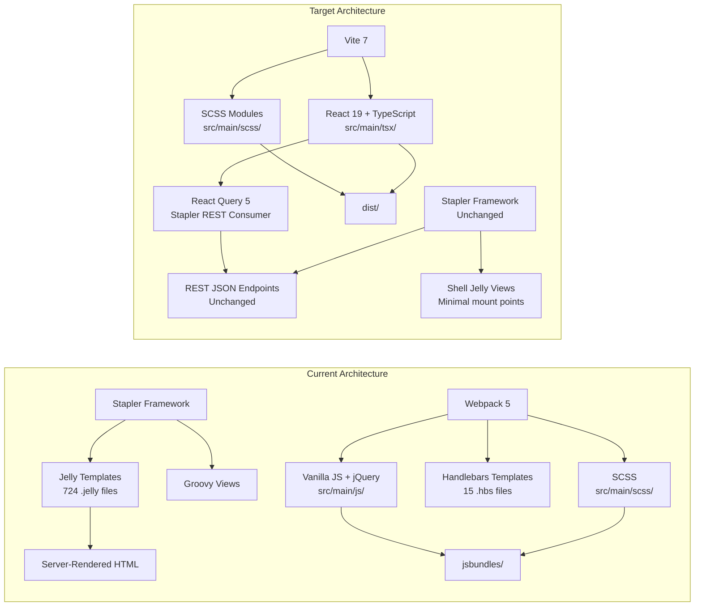

# Technical Specification

# 0. Agent Action Plan

## 0.1 Intent Clarification

### 0.1.1 Core Refactoring Objective

Based on the prompt, the Blitzy platform understands that the refactoring objective is to **migrate the Jenkins core UI from its current Jelly/legacy JavaScript rendering architecture to a React 19 + TypeScript frontend**, while preserving complete functional symmetry with the existing interface as validated by automated screenshot comparison between a baseline Jenkins instance and the refactored Jenkins instance running in parallel on Kubernetes.

- **Refactoring type**: Tech stack migration — replacing server-side Jelly template rendering and legacy vanilla JavaScript/jQuery/Handlebars client-side code with React 19 component-based architecture and TypeScript
- **Target repository**: Same repository (`jenkinsci/jenkins`) — the refactored React frontend is introduced alongside the existing Jelly views within the existing mono-repository structure
- **Scope boundary**: Strictly the frontend presentation layer — no backend Java code, Stapler endpoints, plugin APIs, or pipeline DSL are modified

The refactoring goals, restated with enhanced clarity:

- **Replace Jelly server-side rendering with React client-side rendering**: Every Jelly view surface currently rendered by the Stapler/Jelly pipeline must be re-implemented as a React 19 component that fetches its data from the existing Stapler REST endpoints and renders an equivalent DOM output
- **Replace legacy JavaScript modules with TypeScript React components**: The 10 top-level JS modules, 11 component directories, 6 page directories, 3 API modules, 12 utility modules, and 15 Handlebars templates currently in `src/main/js/` must be systematically replaced with typed React equivalents
- **Replace the Webpack 5 build pipeline with Vite**: The current Webpack 5.104.1 bundler with 18 entry points must be replaced by Vite 7.x as the build tool, providing faster HMR and a modern development experience
- **Consume all existing Stapler REST endpoints as-is**: No new backend routes, no changes to endpoint signatures, response contracts, or authentication flows — the React layer is a pure consumer of the existing API surface
- **Validate migration via screenshot symmetry**: Playwright-based visual regression testing captures baseline screenshots from the original Jelly-rendered Jenkins instance and compares them pixel-by-pixel against the refactored React-rendered instance, with per-view threshold-based pass/fail gating
- **Preserve all existing session handling, URL routing patterns, and functional behavior**: Every user-visible URL, authenticated session flow, and functional capability must remain identical after migration

Implicit requirements surfaced through analysis:

- **CSRF crumb handling must be preserved**: The existing `crumb.init()` pattern in `pluginManager.js` and `staplerPost()` in `securityConfig.js` must be replicated in the React API layer
- **BehaviorShim pattern replacement**: The `Behaviour.specify(selector, id, priority, handler)` registration pattern used by all 11 client-side components must be replaced with React component lifecycle equivalents
- **Plugin ecosystem compatibility**: jQuery 3.7.1 and Bootstrap 3.4.1 are global dependencies consumed by 2,000+ plugins — they must remain available in the global scope even as core React components stop depending on them internally
- **Localization continuity**: The `getI18n()` utility and `loadTranslations()` pattern in `jenkins.js` must be preserved to maintain i18n support across 50+ locales
- **SVG symbol system preservation**: The `symbols.js` constants referencing inline SVG paths in `war/src/main/resources/images/symbols/` must remain functional

### 0.1.2 Technical Interpretation

This refactoring translates to the following technical transformation strategy:

**Current Architecture → Target Architecture**



**Transformation Rules**:

- Each Jelly view currently producing a full page of HTML is replaced by a minimal Jelly shell that mounts a React root element, plus a corresponding React component tree that renders the identical UI
- Each JavaScript module in `src/main/js/` is rewritten as a TypeScript module in `src/main/tsx/` using React hooks and component patterns
- Each Handlebars `.hbs` template is replaced by a JSX/TSX component
- jQuery AJAX calls (`$.ajax`, `jenkins.get`, `jenkins.post`) are replaced by React Query `useQuery`/`useMutation` hooks calling the same Stapler endpoints
- The `behaviorShim.specify()` DOM-mutation pattern is replaced by React component mounting and effect hooks
- The SCSS architecture is preserved and consumed by the new React components via CSS Modules or direct imports, maintaining visual parity


## 0.2 Source Analysis

### 0.2.1 Comprehensive Source File Discovery

The Jenkins core repository is a Maven multi-module project with its frontend assets distributed across three primary locations: `src/main/js/` (JavaScript source), `src/main/scss/` (SCSS styling), and `core/src/main/resources/` (Jelly templates). The build pipeline uses Webpack 5.104.1 with 18 entry points, outputting bundles to `war/src/main/webapp/jsbundles/`. Additionally, legacy unbundled scripts reside in `war/src/main/webapp/scripts/`.

**Search patterns applied to identify ALL files requiring refactoring**:

- JavaScript source modules: `src/main/js/**/*.js` — 10 top-level entry files + 8 subdirectories
- Handlebars templates: `src/main/js/templates/**/*.hbs` — 15 template files
- SCSS source files: `src/main/scss/**/*.scss` — 69 files across 5 subdirectories
- Legacy webapp scripts: `war/src/main/webapp/scripts/*.js` — 8 files (3,999 total lines)
- Jelly templates (in-scope views): `core/src/main/resources/**/*.jelly` — 724 total files
- Build configuration: `webpack.config.js`, `eslint.config.cjs`, `postcss.config.js`, `package.json`, `.prettierrc.json`, `.stylelintrc.js`, `.yarnrc.yml`
- Webapp static assets: `war/src/main/webapp/css/`, `war/src/main/webapp/favicon.svg`, `war/src/main/webapp/robots.txt`

### 0.2.2 Current Structure Mapping

```
Current:
├── package.json                          (jenkins-ui v1.0.0 - runtime + dev deps)
├── webpack.config.js                     (18 entry points, Webpack 5.104.1)
├── eslint.config.cjs                     (ESLint 9 flat config, ecmaVersion 2022)
├── postcss.config.js                     (postcss-scss parser + postcss-preset-env)
├── .prettierrc.json                      (Prettier 3.8.1 config)
├── .stylelintrc.js                       (Stylelint 17.1.0 config)
├── .yarnrc.yml                           (Yarn 4.12.0, nodeLinker: node-modules)
│
├── src/main/js/                          (Frontend JavaScript source)
│   ├── app.js                            (Main entry - bootstraps 9 components)
│   ├── pluginSetupWizard.js              (Setup wizard entry point)
│   ├── pluginSetupWizardGui.js           (Setup wizard orchestrator)
│   ├── plugin-manager-ui.js              (Plugin manager entry)
│   ├── add-item.js                       (New item page logic)
│   ├── section-to-sidebar-items.js       (Sidebar navigation)
│   ├── section-to-tabs.js               (Tab navigation)
│   ├── sortable-drag-drop.js            (Drag-and-drop handler)
│   ├── keyboard-shortcuts.js            (Keyboard navigation)
│   │
│   ├── api/                              (API communication layer)
│   │   ├── pluginManager.js              (Plugin install/status/search, CSRF crumbs)
│   │   ├── search.js                     (Search endpoint via document.body.dataset)
│   │   └── securityConfig.js             (saveFirstUser, saveConfigureInstance, staplerPost)
│   │
│   ├── components/                       (UI components - behaviorShim pattern)
│   │   ├── command-palette/              (Ctrl+K command palette)
│   │   ├── confirmation-link/            (Confirmation dialog links)
│   │   ├── defer/                        (Lazy-loading component)
│   │   ├── dialogs/                      (Modal dialogs)
│   │   ├── dropdowns/                    (Dropdown menus)
│   │   ├── header/                       (Page header)
│   │   ├── notifications/                (Toast notifications)
│   │   ├── row-selection-controller/     (Table row selection)
│   │   ├── search-bar/                   (Global search)
│   │   ├── stop-button-link/             (Build stop button)
│   │   └── tooltips/                     (Tippy.js tooltip wrapper)
│   │
│   ├── pages/                            (Page-specific modules)
│   │   ├── cloud-set/                    (Cloud configuration - sortable tables)
│   │   ├── computer-set/                 (Node management - icon legend modal)
│   │   ├── dashboard/                    (Dashboard - icon legend)
│   │   ├── manage-jenkins/               (Admin - search suggestions + diagnostics)
│   │   ├── project/                      (Project - builds-card auto-refresh)
│   │   └── register/                     (Registration - password strength UX)
│   │
│   ├── templates/                        (Handlebars templates - 15 files)
│   │   ├── pluginSetupWizard.hbs
│   │   ├── welcomePanel.hbs
│   │   ├── progressPanel.hbs
│   │   ├── pluginSelectionPanel.hbs
│   │   ├── pluginSelectList.hbs
│   │   ├── successPanel.hbs
│   │   ├── setupCompletePanel.hbs
│   │   ├── errorPanel.hbs
│   │   ├── offlinePanel.hbs
│   │   ├── loadingPanel.hbs
│   │   ├── proxyConfigPanel.hbs
│   │   ├── configureInstance.hbs
│   │   ├── firstUserPanel.hbs
│   │   ├── incompleteInstallationPanel.hbs
│   │   └── plugin-manager/available.hbs
│   │
│   ├── util/                             (12 utility modules)
│   │   ├── behavior-shim.js              (Behaviour.specify wrapper)
│   │   ├── dom.js                        (createElementFromHtml, toId)
│   │   ├── i18n.js                       (getI18n localization)
│   │   ├── jenkins.js                    (baseUrl, goTo, get/post, loadTranslations)
│   │   ├── jenkinsLocalStorage.js        (Scoped localStorage)
│   │   ├── jquery-ext.js                 (:containsci selector extension)
│   │   ├── keyboard.js                   (makeKeyboardNavigable)
│   │   ├── localStorage.js              (Browser storage wrapper)
│   │   ├── page.js                       (onload, scroll helpers)
│   │   ├── path.js                       (combinePath utility)
│   │   ├── security.js                   (xmlEscape)
│   │   └── symbols.js                    (SVG icon constants)
│   │
│   ├── handlebars-helpers/               (5 Handlebars helpers)
│   │   ├── id.js, ifeq.js, ifneq.js, in-array.js, replace.js
│   │
│   └── plugin-setup-wizard/
│       └── bootstrap-detached.js         (Bootstrap 3.3.5 scoped injection)
│
├── src/main/scss/                        (SCSS styling - 69 files)
│   ├── styles.scss                       (Main stylesheet entry)
│   ├── simple-page.scss                  (Minimal page styling)
│   ├── pluginSetupWizard.scss            (Setup wizard styles)
│   ├── _bootstrap.scss                   (Bootstrap 3.4.1 under .bootstrap-3)
│   ├── abstracts/                        (_colors.scss, _mixins.scss, _theme.scss)
│   ├── base/                             (9 files: breakpoints, core, display, layout, etc.)
│   ├── components/                       (32 files: alert→tooltips)
│   ├── form/                             (13 files: checkbox→validation)
│   └── pages/                            (11 files: about→sign-in-register)
│
├── war/src/main/webapp/
│   ├── jsbundles/                        (Webpack output directory - 18 bundles)
│   ├── scripts/                          (8 legacy unbundled JS - 3,999 lines total)
│   │   ├── hudson-behavior.js            (2,741 lines - core DOM behaviors)
│   │   ├── sortable.js                   (468 lines)
│   │   ├── combobox.js                   (410 lines)
│   │   ├── behavior.js                   (207 lines)
│   │   ├── utilities.js                  (94 lines)
│   │   ├── loading.js                    (68 lines)
│   │   ├── apply.js                      (8 lines)
│   │   └── redirect.js                   (3 lines)
│   ├── css/responsive-grid.css           (Bootstrap 3.1.1 grid)
│   ├── help/                             (Localized HTML help fragments)
│   ├── images/                           (SVG icons and graphics)
│   ├── WEB-INF/                          (web.xml, deployment descriptors)
│   ├── favicon.svg, mask-icon.svg, robots.txt
│   └── ...
│
├── core/src/main/resources/              (Jelly templates - 724 files)
│   ├── lib/layout/                       (65 reusable layout components)
│   │   ├── layout.jelly                  (Outer page shell)
│   │   ├── header.jelly                  (Page header)
│   │   ├── side-panel.jelly              (Side navigation panel)
│   │   ├── main-panel.jelly              (Main content area)
│   │   ├── breadcrumbBar.jelly           (Breadcrumb navigation)
│   │   ├── tabBar.jelly, tab.jelly       (Tab navigation)
│   │   ├── dialog.jelly                  (Modal dialogs)
│   │   ├── card.jelly                    (Card container)
│   │   ├── command-palette.jelly         (Command palette mount)
│   │   ├── search-bar.jelly              (Search bar mount)
│   │   ├── spinner.jelly, skeleton.jelly (Loading states)
│   │   └── dropdowns/*.jelly             (Dropdown system)
│   │
│   ├── lib/form/                         (57 form components)
│   │   ├── textbox.jelly, textarea.jelly, checkbox.jelly
│   │   ├── select.jelly, password.jelly, radio.jelly
│   │   ├── combobox.jelly, optionalBlock.jelly
│   │   ├── repeatable.jelly, hetero-list.jelly
│   │   ├── entry.jelly, section.jelly, advanced.jelly
│   │   └── submit.jelly, file.jelly, ...
│   │
│   ├── lib/hudson/                       (59 Hudson UI components)
│   │   ├── projectView.jelly, projectViewRow.jelly
│   │   ├── buildListTable.jelly, buildHealth.jelly
│   │   ├── executors.jelly, queue.jelly
│   │   ├── editableDescription.jelly
│   │   ├── scriptConsole.jelly
│   │   └── artifactList.jelly, ...
│   │
│   ├── hudson/model/                     (191 model views)
│   │   ├── AllView/ (1), ListView/ (4), MyView/, ProxyView/
│   │   ├── Job/ (index, main, configure, buildTimeTrend, ...)
│   │   ├── AbstractProject/ (8+), FreeStyleProject/ (2)
│   │   ├── Run/ (19: index, console, artifacts, delete, ...)
│   │   ├── AbstractBuild/ (5), Computer/ (12), ComputerSet/ (6)
│   │   └── View/ (index, main, configure, newJob, builds, ...)
│   │
│   ├── hudson/PluginManager/             (14 plugin manager views)
│   │   ├── index.jelly, installed.jelly, available.jelly
│   │   ├── updates.jelly, advanced.jelly
│   │   └── table.jelly, ...
│   │
│   ├── jenkins/model/                    (60+ views)
│   ├── jenkins/security/                 (25 security views)
│   ├── hudson/views/                     (25 view templates)
│   └── hudson/slaves/                    (29 agent-related views)
│
└── docs/
    └── MAINTAINERS.adoc                  (Only existing doc file)
```

### 0.2.3 File Inventory Summary

| Category | Location | Count | Description |
|----------|----------|-------|-------------|
| JS Entry Points | `src/main/js/*.js` | 10 | Top-level Webpack entry modules |
| JS Components | `src/main/js/components/` | 11 directories | Interactive UI components using behaviorShim |
| JS Pages | `src/main/js/pages/` | 6 directories | Page-specific enhancement modules |
| JS API | `src/main/js/api/` | 3 files | Stapler REST communication layer |
| JS Utilities | `src/main/js/util/` | 12 files | Shared utility functions |
| Handlebars Templates | `src/main/js/templates/` | 15 files | Client-side template rendering |
| Handlebars Helpers | `src/main/js/handlebars-helpers/` | 5 files | Template helper functions |
| Plugin Setup Wizard | `src/main/js/plugin-setup-wizard/` | 1 file | Bootstrap 3.3.5 scoped injection |
| SCSS Abstracts | `src/main/scss/abstracts/` | 4 files | Colors, mixins, theme tokens |
| SCSS Base | `src/main/scss/base/` | 9 files | Breakpoints, core, layout, typography |
| SCSS Components | `src/main/scss/components/` | 32 files | UI component styles |
| SCSS Form | `src/main/scss/form/` | 13 files | Form control styles |
| SCSS Pages | `src/main/scss/pages/` | 11 files | Page-specific styles |
| SCSS Root | `src/main/scss/*.scss` | 4 files | Entry points and Bootstrap namespace |
| Legacy Scripts | `war/src/main/webapp/scripts/` | 8 files | Unbundled legacy JS (3,999 lines) |
| Jelly Layout Lib | `core/src/main/resources/lib/layout/` | 65 files | Reusable layout components |
| Jelly Form Lib | `core/src/main/resources/lib/form/` | 57 files | Form element templates |
| Jelly Hudson Lib | `core/src/main/resources/lib/hudson/` | 59 files | Hudson UI primitives |
| Jelly Model Views | `core/src/main/resources/hudson/model/` | 191 files | Model-specific views |
| Jelly Jenkins Views | `core/src/main/resources/jenkins/` | 85+ files | Jenkins namespace views |
| Jelly Other | Various | ~267 files | Remaining Jelly templates |
| Build Config | Root | 7 files | webpack, eslint, postcss, prettier, stylelint, yarn |
| Static Assets | `war/src/main/webapp/` | Various | CSS, images, help, WEB-INF |
| **Total Frontend Files** | | **~900+** | All files requiring analysis or transformation |


## 0.3 Scope Boundaries

### 0.3.1 Exhaustively In Scope

**Source Transformations — JavaScript to React/TypeScript**:
- `src/main/js/**/*.js` — All 10 top-level JavaScript entry modules to be rewritten as TypeScript React entry points
- `src/main/js/components/**/*.js` — All 11 component directories to be reimplemented as React components
- `src/main/js/pages/**/*.js` — All 6 page-specific modules to be reimplemented as React page components
- `src/main/js/api/**/*.js` — All 3 API modules to be rewritten as React Query-compatible TypeScript services
- `src/main/js/util/**/*.js` — All 12 utility modules to be migrated to TypeScript utilities and React hooks
- `src/main/js/templates/**/*.hbs` — All 15 Handlebars templates to be replaced by JSX/TSX components
- `src/main/js/handlebars-helpers/**/*.js` — All 5 Handlebars helpers to be eliminated (logic absorbed into React components)
- `src/main/js/plugin-setup-wizard/**/*.js` — Bootstrap scoped injection to be replaced by CSS module scoping

**Source Transformations — Jelly to React Shell Views**:
- `core/src/main/resources/lib/layout/*.jelly` — 65 layout component templates to have React equivalents created; original Jelly files to be reduced to minimal mount-point shells where they serve as page entry points
- `core/src/main/resources/lib/form/*.jelly` — 57 form component templates to have React form component equivalents
- `core/src/main/resources/lib/hudson/*.jelly` — 59 Hudson UI components to have React equivalents
- `core/src/main/resources/hudson/model/**/*.jelly` — 191 model views to have React page/view components created
- `core/src/main/resources/hudson/PluginManager/**/*.jelly` — 14 plugin manager views to be migrated
- `core/src/main/resources/jenkins/**/*.jelly` — Jenkins namespace views (security, management, setup wizard) to be migrated
- `core/src/main/resources/hudson/views/**/*.jelly` — 25 view-related templates to be migrated
- `core/src/main/resources/hudson/slaves/**/*.jelly` — 29 agent views to be migrated

**SCSS Styling (Preserved and Consumed)**:
- `src/main/scss/**/*.scss` — All 69 SCSS files preserved as the styling foundation; consumed by React components via imports
- `src/main/scss/abstracts/_colors.scss` — OKLCH color tokens preserved
- `src/main/scss/abstracts/_theme.scss` — Theme system with prefers-contrast overrides preserved
- `src/main/scss/_bootstrap.scss` — Bootstrap 3.4.1 scoped namespace preserved for plugin compatibility

**Legacy Script Migration**:
- `war/src/main/webapp/scripts/hudson-behavior.js` — 2,741-line core DOM behavior module to be systematically replaced by React component behaviors
- `war/src/main/webapp/scripts/combobox.js` — 410-line combobox to be replaced by React combobox component
- `war/src/main/webapp/scripts/sortable.js` — 468-line sortable to be replaced by React drag-and-drop
- `war/src/main/webapp/scripts/behavior.js` — 207-line behavior registration replaced by React lifecycle
- `war/src/main/webapp/scripts/utilities.js` — 94-line utilities absorbed into TypeScript utils
- `war/src/main/webapp/scripts/loading.js` — 68-line loading indicator replaced by React loading components
- `war/src/main/webapp/scripts/apply.js` — 8-line form apply logic absorbed into React form handling
- `war/src/main/webapp/scripts/redirect.js` — 3-line redirect replaced by React Router or navigation utility

**Build Configuration**:
- `package.json` — Complete overhaul: replace Webpack dependencies with Vite, add React 19, TypeScript, React Query, Playwright, Vitest
- `webpack.config.js` — Replace entirely with `vite.config.ts`
- `eslint.config.cjs` — Update to support TypeScript and React JSX rules
- `postcss.config.js` — Preserve with minimal updates for Vite compatibility
- `.prettierrc.json` — Update to include TSX file support
- `.stylelintrc.js` — Preserve with minimal updates
- `.yarnrc.yml` — Preserve Yarn 4 configuration

**Testing Infrastructure (New)**:
- `src/main/tsx/**/*.test.tsx` — Unit tests for all React components using Vitest + React Testing Library
- `e2e/**/*.spec.ts` — Playwright end-to-end tests covering all user flows
- `e2e/screenshots/` — Baseline and refactored screenshot captures per view
- `playwright.config.ts` — Playwright configuration for visual regression

**Documentation**:
- `docs/screenshots/**/*.png` — Baseline and refactored screenshots per UI surface
- `docs/user-flows.md` — User flow definitions covering all specified scenarios
- `docs/functional-audit.md` — Per-view migration status and screenshot diff results
- `README.md` — Update with new frontend development instructions

**Webpack Output Directory**:
- `war/src/main/webapp/jsbundles/` — Output target for Vite build (replacing Webpack output)

### 0.3.2 Explicitly Out of Scope

**Backend Java Code — Not Modified**:
- `core/src/main/java/**/*.java` — All Java source code including Stapler endpoints, model classes, security framework, and extension points
- `core/src/main/resources/**/*.properties` — ResourceBundle localization files (consumed by Jelly server-side, not modified)
- `core/src/test/java/**/*.java` — Java unit tests

**Stapler REST API — Not Modified**:
- All `doXxx()` handler methods — No changes to endpoint signatures
- All `@Exported`/`@ExportedBean` annotations — No changes to response contracts
- All authentication/authorization flows — `ACL.hasPermission()`, `SidACL` chain, CSRF crumb generation unchanged

**Plugin Extension Points — Not Modified**:
- `@Extension` annotation behavior and `ExtensionList` discovery
- `Describable`/`Descriptor` pattern
- Plugin-contributed Jelly views (these are within individual plugin repositories, not in core)

**Pipeline DSL — Not Modified**:
- Declarative and Scripted Pipeline syntax and execution
- Pipeline step definitions and implementations

**Maven Build System — Not Modified**:
- `pom.xml` (root and module-level) — Maven build configuration unchanged except for frontend-maven-plugin integration to invoke Vite instead of Webpack
- `bom/pom.xml` — Bill of Materials unchanged
- All Maven module structures (`core/`, `war/`, `cli/`, `websocket/`, `test/`, `coverage/`)

**Infrastructure and Deployment Configuration — Not Modified**:
- `war/src/main/webapp/WEB-INF/web.xml` — Servlet configuration unchanged
- `war/src/main/webapp/WEB-INF/sun-web.xml`, `jboss-web.xml`, `ibm-web-bnd.xmi` — Deployment descriptors unchanged
- `.github/workflows/` — CI/CD pipelines (may require minor updates for Vite build commands)

**Static Assets — Not Modified**:
- `war/src/main/webapp/help/**/*.html` — Inline help HTML fragments
- `war/src/main/webapp/images/` — SVG icons and images
- `war/src/main/webapp/favicon.svg`, `mask-icon.svg`, `robots.txt`
- `war/src/main/resources/images/symbols/` — SVG symbol glyphs


## 0.4 Target Design

### 0.4.1 Refactored Structure Planning

The target architecture introduces a React 19 + TypeScript frontend alongside the existing Maven project structure. The new `src/main/tsx/` directory replaces `src/main/js/` as the primary frontend source, while `src/main/scss/` is preserved with its existing architecture. Vite replaces Webpack as the build tool, outputting to the same `war/src/main/webapp/jsbundles/` directory to maintain WAR packaging compatibility.

```
Target:
├── package.json                          (Updated: React 19, Vite 7, TypeScript, React Query 5)
├── vite.config.ts                        (NEW: Replaces webpack.config.js - 18 entry points)
├── tsconfig.json                         (NEW: TypeScript root config)
├── tsconfig.app.json                     (NEW: App-specific TS config)
├── tsconfig.node.json                    (NEW: Node/Vite TS config)
├── eslint.config.cjs                     (UPDATED: Add TypeScript + React rules)
├── postcss.config.js                     (PRESERVED: Minor Vite compatibility)
├── .prettierrc.json                      (UPDATED: Add TSX support)
├── .stylelintrc.js                       (PRESERVED)
├── .yarnrc.yml                           (PRESERVED)
├── playwright.config.ts                  (NEW: Visual regression config)
│
├── src/main/tsx/                          (NEW: React 19 + TypeScript frontend)
│   ├── main.tsx                           (Application bootstrap, React root mount)
│   ├── App.tsx                            (Root component with QueryClientProvider)
│   │
│   ├── api/                               (Stapler REST API layer)
│   │   ├── client.ts                      (Base HTTP client with CSRF crumb handling)
│   │   ├── pluginManager.ts               (Plugin install/status/search queries)
│   │   ├── search.ts                      (Search endpoint integration)
│   │   ├── security.ts                    (User/instance config mutations)
│   │   └── types.ts                       (API response type definitions)
│   │
│   ├── components/                        (Shared React UI components)
│   │   ├── command-palette/
│   │   │   └── CommandPalette.tsx          (Ctrl+K command palette)
│   │   ├── confirmation-link/
│   │   │   └── ConfirmationLink.tsx        (Confirmation dialog trigger)
│   │   ├── defer/
│   │   │   └── Defer.tsx                   (Lazy-loading wrapper with Suspense)
│   │   ├── dialogs/
│   │   │   └── Dialog.tsx                  (Modal dialog component)
│   │   ├── dropdowns/
│   │   │   └── Dropdown.tsx                (Dropdown menu component)
│   │   ├── header/
│   │   │   └── Header.tsx                  (Page header with navigation)
│   │   ├── notifications/
│   │   │   └── Notifications.tsx           (Toast notification system)
│   │   ├── row-selection-controller/
│   │   │   └── RowSelectionController.tsx  (Table row multi-select)
│   │   ├── search-bar/
│   │   │   └── SearchBar.tsx               (Global search with suggestions)
│   │   ├── stop-button-link/
│   │   │   └── StopButtonLink.tsx          (Build abort trigger)
│   │   └── tooltips/
│   │       └── Tooltip.tsx                 (Accessible tooltip wrapper)
│   │
│   ├── layout/                            (Layout primitives replacing lib/layout Jelly)
│   │   ├── Layout.tsx                      (Page shell: header + side-panel + main-panel)
│   │   ├── SidePanel.tsx                   (Side navigation panel)
│   │   ├── MainPanel.tsx                   (Main content area)
│   │   ├── BreadcrumbBar.tsx               (Breadcrumb navigation)
│   │   ├── TabBar.tsx                      (Tab navigation container)
│   │   ├── Tab.tsx                         (Individual tab)
│   │   ├── Card.tsx                        (Card container)
│   │   ├── Skeleton.tsx                    (Loading skeleton)
│   │   └── Spinner.tsx                     (Loading spinner)
│   │
│   ├── forms/                             (Form components replacing lib/form Jelly)
│   │   ├── FormEntry.tsx                   (Form field wrapper with label/help)
│   │   ├── FormSection.tsx                 (Form section grouping)
│   │   ├── TextBox.tsx                     (Text input)
│   │   ├── TextArea.tsx                    (Multi-line text input)
│   │   ├── Checkbox.tsx                    (Boolean checkbox)
│   │   ├── Select.tsx                      (Dropdown select)
│   │   ├── Password.tsx                    (Password input)
│   │   ├── Radio.tsx                       (Radio button group)
│   │   ├── ComboBox.tsx                    (Autocomplete combobox)
│   │   ├── FileUpload.tsx                  (File upload input)
│   │   ├── OptionalBlock.tsx               (Collapsible optional section)
│   │   ├── Repeatable.tsx                  (Dynamic repeatable field group)
│   │   ├── HeteroList.tsx                  (Heterogeneous describable list)
│   │   ├── AdvancedBlock.tsx               (Expandable advanced options)
│   │   └── SubmitButton.tsx                (Form submit with action handling)
│   │
│   ├── hudson/                            (Hudson UI primitives replacing lib/hudson Jelly)
│   │   ├── ProjectView.tsx                 (Project listing view)
│   │   ├── ProjectViewRow.tsx              (Single project row)
│   │   ├── BuildListTable.tsx              (Build history table)
│   │   ├── BuildHealth.tsx                 (Build health indicator)
│   │   ├── BuildLink.tsx                   (Build link with status icon)
│   │   ├── BuildProgressBar.tsx            (Build progress indicator)
│   │   ├── Executors.tsx                   (Executor status panel)
│   │   ├── Queue.tsx                       (Build queue panel)
│   │   ├── EditableDescription.tsx         (Inline-editable description)
│   │   ├── ScriptConsole.tsx               (Script console interface)
│   │   └── ArtifactList.tsx                (Build artifact listing)
│   │
│   ├── pages/                             (Page-level view components)
│   │   ├── dashboard/
│   │   │   ├── Dashboard.tsx               (Main dashboard view)
│   │   │   ├── AllView.tsx                 (All jobs view)
│   │   │   ├── ListView.tsx                (Filtered list view)
│   │   │   └── MyView.tsx                  (Personal view)
│   │   ├── job/
│   │   │   ├── JobIndex.tsx                (Job main page)
│   │   │   ├── JobConfigure.tsx            (Job configuration form)
│   │   │   ├── JobBuildHistory.tsx          (Build time trend)
│   │   │   └── NewJob.tsx                   (Create new item page)
│   │   ├── build/
│   │   │   ├── BuildIndex.tsx               (Build detail page)
│   │   │   ├── ConsoleOutput.tsx            (Real-time console output)
│   │   │   ├── ConsoleFull.tsx              (Full console output)
│   │   │   ├── BuildArtifacts.tsx           (Build artifacts listing)
│   │   │   └── BuildChanges.tsx             (Build changelog)
│   │   ├── computer/
│   │   │   ├── ComputerSet.tsx              (Nodes management page)
│   │   │   └── ComputerDetail.tsx           (Individual node detail)
│   │   ├── plugin-manager/
│   │   │   ├── PluginManagerIndex.tsx        (Plugin manager main)
│   │   │   ├── PluginInstalled.tsx           (Installed plugins list)
│   │   │   ├── PluginAvailable.tsx           (Available plugins search)
│   │   │   ├── PluginUpdates.tsx             (Plugin updates list)
│   │   │   └── PluginAdvanced.tsx            (Advanced settings)
│   │   ├── manage-jenkins/
│   │   │   ├── ManageJenkins.tsx             (Admin landing page)
│   │   │   └── SystemInformation.tsx         (System info diagnostics)
│   │   ├── setup-wizard/
│   │   │   ├── SetupWizard.tsx               (Wizard orchestrator)
│   │   │   ├── WelcomePanel.tsx              (Welcome step)
│   │   │   ├── PluginSelectionPanel.tsx      (Plugin selection step)
│   │   │   ├── ProgressPanel.tsx             (Installation progress)
│   │   │   ├── FirstUserPanel.tsx            (First admin user creation)
│   │   │   ├── ConfigureInstancePanel.tsx    (Instance URL configuration)
│   │   │   ├── ProxyConfigPanel.tsx          (Proxy settings step)
│   │   │   └── SetupCompletePanel.tsx        (Completion step)
│   │   ├── security/
│   │   │   └── SignInRegister.tsx             (Login/registration page)
│   │   └── cloud/
│   │       └── CloudSet.tsx                   (Cloud configuration page)
│   │
│   ├── hooks/                              (Shared React hooks)
│   │   ├── useStaplerQuery.ts               (React Query wrapper for Stapler GET)
│   │   ├── useStaplerMutation.ts            (React Query wrapper for Stapler POST)
│   │   ├── useCrumb.ts                      (CSRF crumb management hook)
│   │   ├── useI18n.ts                       (Localization hook)
│   │   ├── useKeyboardShortcut.ts           (Keyboard shortcut hook)
│   │   ├── useJenkinsNavigation.ts          (URL navigation hook)
│   │   └── useLocalStorage.ts               (Scoped localStorage hook)
│   │
│   ├── providers/                          (React context providers)
│   │   ├── QueryProvider.tsx                (React Query client provider)
│   │   ├── JenkinsConfigProvider.tsx        (Base URL, crumb, auth context)
│   │   └── I18nProvider.tsx                 (Localization context)
│   │
│   ├── types/                              (Shared TypeScript types)
│   │   ├── jenkins.d.ts                     (Global Jenkins type definitions)
│   │   ├── stapler.d.ts                     (Stapler response types)
│   │   ├── models.ts                        (Job, Build, View, Computer, etc.)
│   │   └── vite-env.d.ts                    (Vite environment types)
│   │
│   └── utils/                              (TypeScript utility functions)
│       ├── dom.ts                           (DOM utilities)
│       ├── security.ts                      (xmlEscape and sanitization)
│       ├── path.ts                          (URL path combination)
│       ├── symbols.ts                       (SVG icon constants)
│       └── baseUrl.ts                       (Jenkins base URL resolution)
│
├── src/main/scss/                          (PRESERVED: Existing SCSS architecture)
│   └── (all 69 files unchanged)
│
├── e2e/                                    (NEW: Playwright E2E + Visual Regression)
│   ├── fixtures/
│   │   └── jenkins.ts                       (Jenkins page object model)
│   ├── flows/
│   │   ├── dashboard.spec.ts                (Dashboard user flow tests)
│   │   ├── job-create.spec.ts               (Job creation flow tests)
│   │   ├── build-trigger.spec.ts            (Build trigger flow tests)
│   │   ├── console-output.spec.ts           (Console output flow tests)
│   │   ├── build-history.spec.ts            (Build history flow tests)
│   │   ├── job-configure.spec.ts            (Job configuration flow tests)
│   │   ├── plugin-manager.spec.ts           (Plugin management flow tests)
│   │   └── custom-views.spec.ts             (Custom views flow tests)
│   └── visual/
│       └── screenshot-comparison.spec.ts    (Visual regression per view)
│
├── docs/                                   (NEW: Migration documentation)
│   ├── screenshots/                        (Baseline + refactored captures per view)
│   │   ├── dashboard/
│   │   │   ├── baseline.png
│   │   │   └── refactored.png
│   │   ├── job-index/
│   │   ├── job-configure/
│   │   ├── build-console/
│   │   ├── plugin-manager/
│   │   ├── manage-jenkins/
│   │   └── setup-wizard/
│   ├── user-flows.md                       (User flow definitions)
│   └── functional-audit.md                 (Per-view migration status)
│
└── war/src/main/webapp/jsbundles/          (Vite build output target - same location)
```

### 0.4.2 Web Search Research Conducted

Research was conducted on the following topics to inform the target design:

- **React 19 stable release**: React 19.2.x is the latest stable line (v19.2.1 as of December 2025), with Actions API, `useActionState`, concurrent rendering by default, and automatic batching across promises/setTimeout/native event handlers
- **Vite 7**: Vite 7.3.1 is the latest stable version, requiring Node.js 20.19+ or 22.12+, distributed as ESM-only, with Baseline Widely Available as the default browser target
- **React Query (TanStack Query) 5**: Version 5.90.21 is the latest stable, compatible with React 18+ (including React 19), providing `useQuery`/`useMutation` hooks for server state management
- **Playwright visual regression**: Playwright provides built-in `toHaveScreenshot()` for visual comparison using the pixelmatch library, with configurable `maxDiffPixels` thresholds, mask locators for dynamic content, and CI-ready diff image generation
- **Jenkins React plugin pattern**: The `jenkinsci/react-plugin-template` demonstrates the iframe-based sandboxing approach used historically to isolate React from Jenkins global JS pollution (Prototype.js, jQuery); the core migration can use a more integrated approach since it controls the global scope

### 0.4.3 Design Pattern Applications

- **Component Composition Pattern**: React components mirror the Jelly tag library hierarchy — `Layout` wraps `SidePanel` + `MainPanel`, `FormSection` wraps `FormEntry` wraps specific input types — enabling the same compositional flexibility that Jelly tag libraries provide
- **Server State Management via React Query**: All data fetched from Stapler REST endpoints is treated as server state, managed by React Query's cache with configurable stale times, background refetching, and optimistic updates for mutations
- **Custom Hook Abstraction**: `useStaplerQuery` and `useStaplerMutation` hooks encapsulate the CSRF crumb injection, base URL resolution, and error handling that currently live in `jenkins.js` and `pluginManager.js`
- **Provider Pattern**: `JenkinsConfigProvider` injects `baseUrl`, crumb data, and authentication state via React Context, replacing the `document.head.dataset.rooturl` and `crumb.init()` patterns
- **React 19 Actions for Forms**: Form submissions (job configuration save, plugin install, first-user setup) use React 19's `<form action={}>` pattern with `useActionState` for pending/error state management, replacing jQuery AJAX form submissions

### 0.4.4 User Interface Design

Key requirements and actions for the UI migration:

- **Visual Symmetry**: The refactored React UI must render identically to the current Jelly-rendered UI — same layout, colors, typography, spacing, and interactive behaviors — validated by Playwright screenshot comparison
- **SCSS Preservation**: All 69 SCSS files are preserved unchanged. React components import and consume the existing SCSS architecture via Vite's CSS import system, ensuring zero visual regression from styling changes
- **Incremental Mount Strategy**: Each Jelly view that serves as a page entry point is reduced to a minimal shell that includes the React bundle and provides a `<div id="react-root">` mount point. The React component tree renders the full page content, consuming data from Stapler REST endpoints that the Jelly view previously rendered server-side
- **Progressive Enhancement for Plugin Views**: Plugin-contributed Jelly views (out of scope) continue rendering through the existing Stapler/Jelly pipeline. The React shell layout accommodates these by providing extension point slots where plugin content is injected unchanged
- **Accessibility Continuity**: All ARIA attributes, keyboard navigation patterns, and focus management present in the current UI must be replicated in the React components


## 0.5 Transformation Mapping

### 0.5.1 File-by-File Transformation Plan

The following table maps every target file to its source file(s) with the transformation mode and key changes. Transformation modes:
- **UPDATE** — Modify an existing file in place
- **CREATE** — Create a new file (may reference a source for patterns)
- **REFERENCE** — Use as pattern/style guide only

**Build Configuration and Project Root**

| Target File | Transformation | Source File | Key Changes |
|------------|---------------|-------------|-------------|
| `package.json` | UPDATE | `package.json` | Remove Webpack/jQuery/Handlebars deps; add React 19, ReactDOM, TypeScript, Vite 7, React Query 5, Playwright, Vitest, React Testing Library; update scripts to Vite commands; preserve Yarn 4.12.0 packageManager |
| `vite.config.ts` | CREATE | `webpack.config.js` | Replicate 18 entry points as Vite multi-page config; configure `@vitejs/plugin-react`; set output to `war/src/main/webapp/jsbundles/`; configure SCSS with Dart Sass; set alias `@` → `src/main/tsx` |
| `tsconfig.json` | CREATE | — | Root TypeScript config with project references |
| `tsconfig.app.json` | CREATE | — | App TS config: target ESNext, jsx react-jsx, strict mode, path aliases |
| `tsconfig.node.json` | CREATE | — | Node TS config for Vite config file |
| `eslint.config.cjs` | UPDATE | `eslint.config.cjs` | Add `@typescript-eslint/parser`, `eslint-plugin-react`, `eslint-plugin-react-hooks`, `eslint-plugin-react-refresh` rules; update ignore patterns |
| `postcss.config.js` | UPDATE | `postcss.config.js` | Minimal updates for Vite compatibility |
| `.prettierrc.json` | UPDATE | `.prettierrc.json` | Add `.tsx`, `.ts` to overrides |
| `.stylelintrc.js` | UPDATE | `.stylelintrc.js` | No significant changes |
| `.yarnrc.yml` | UPDATE | `.yarnrc.yml` | No significant changes |
| `playwright.config.ts` | CREATE | — | Configure Chromium projects, screenshot directory, diff thresholds, base URL for Jenkins test instances |

**TypeScript Type Definitions**

| Target File | Transformation | Source File | Key Changes |
|------------|---------------|-------------|-------------|
| `src/main/tsx/types/jenkins.d.ts` | CREATE | `src/main/js/util/jenkins.js` | Global Jenkins type definitions: baseUrl, crumb, rootUrl dataset attributes |
| `src/main/tsx/types/stapler.d.ts` | CREATE | `src/main/js/api/pluginManager.js` | Stapler REST response type definitions: plugin objects, search results, update center |
| `src/main/tsx/types/models.ts` | CREATE | `core/src/main/resources/hudson/model/**/*.jelly` | TypeScript interfaces for Job, Build, View, Computer, Queue, Executor, Plugin |
| `src/main/tsx/types/vite-env.d.ts` | CREATE | — | Vite client type reference |

**API Layer — Stapler REST Consumer**

| Target File | Transformation | Source File | Key Changes |
|------------|---------------|-------------|-------------|
| `src/main/tsx/api/client.ts` | CREATE | `src/main/js/util/jenkins.js` | Base HTTP client: fetch-based with CSRF crumb injection via `document.head.dataset`, base URL resolution from `document.head.dataset.rooturl`, JSON parsing |
| `src/main/tsx/api/pluginManager.ts` | CREATE | `src/main/js/api/pluginManager.js` | React Query query/mutation factories for plugin install, status, search, available, updates; preserve CSRF crumb/timeout patterns |
| `src/main/tsx/api/search.ts` | CREATE | `src/main/js/api/search.js` | React Query query factory for search endpoint from `document.body.dataset.searchUrl` |
| `src/main/tsx/api/security.ts` | CREATE | `src/main/js/api/securityConfig.js` | React Query mutations for `saveFirstUser`, `saveConfigureInstance`, `saveProxy` using `staplerPost` equivalent |
| `src/main/tsx/api/types.ts` | CREATE | `src/main/js/api/pluginManager.js` | Consolidated API type exports |

**React Hooks**

| Target File | Transformation | Source File | Key Changes |
|------------|---------------|-------------|-------------|
| `src/main/tsx/hooks/useStaplerQuery.ts` | CREATE | `src/main/js/util/jenkins.js` | Generic React Query wrapper for Stapler GET endpoints with crumb injection and base URL |
| `src/main/tsx/hooks/useStaplerMutation.ts` | CREATE | `src/main/js/util/jenkins.js` | Generic React Query mutation wrapper for Stapler POST with crumb injection |
| `src/main/tsx/hooks/useCrumb.ts` | CREATE | `src/main/js/api/pluginManager.js` | CSRF crumb fetch and caching hook, replacing `crumb.init()` pattern |
| `src/main/tsx/hooks/useI18n.ts` | CREATE | `src/main/js/util/i18n.js` | Localization hook wrapping `loadTranslations()` equivalent |
| `src/main/tsx/hooks/useKeyboardShortcut.ts` | CREATE | `src/main/js/keyboard-shortcuts.js` | Keyboard shortcut registration hook, replacing hotkeys-js direct usage |
| `src/main/tsx/hooks/useJenkinsNavigation.ts` | CREATE | `src/main/js/util/jenkins.js` | Navigation hook wrapping `jenkins.goTo()` and URL construction |
| `src/main/tsx/hooks/useLocalStorage.ts` | CREATE | `src/main/js/util/jenkinsLocalStorage.js` | Scoped localStorage hook |

**Context Providers**

| Target File | Transformation | Source File | Key Changes |
|------------|---------------|-------------|-------------|
| `src/main/tsx/providers/QueryProvider.tsx` | CREATE | — | React Query `QueryClient` provider with default stale time, retry, error handling |
| `src/main/tsx/providers/JenkinsConfigProvider.tsx` | CREATE | `src/main/js/util/jenkins.js` | Context providing baseUrl, crumb, authentication state from `document.head.dataset` |
| `src/main/tsx/providers/I18nProvider.tsx` | CREATE | `src/main/js/util/i18n.js` | Localization context provider |

**Utility Functions**

| Target File | Transformation | Source File | Key Changes |
|------------|---------------|-------------|-------------|
| `src/main/tsx/utils/dom.ts` | CREATE | `src/main/js/util/dom.js` | TypeScript port of `createElementFromHtml`, `toId` |
| `src/main/tsx/utils/security.ts` | CREATE | `src/main/js/util/security.js` | TypeScript port of `xmlEscape` |
| `src/main/tsx/utils/path.ts` | CREATE | `src/main/js/util/path.js` | TypeScript port of `combinePath` |
| `src/main/tsx/utils/symbols.ts` | CREATE | `src/main/js/util/symbols.js` | TypeScript port of SVG icon constants |
| `src/main/tsx/utils/baseUrl.ts` | CREATE | `src/main/js/util/jenkins.js` | Base URL resolution utility |

**Application Bootstrap**

| Target File | Transformation | Source File | Key Changes |
|------------|---------------|-------------|-------------|
| `src/main/tsx/main.tsx` | CREATE | `src/main/js/app.js` | React 19 `createRoot` bootstrap: QueryProvider → JenkinsConfigProvider → I18nProvider → App |
| `src/main/tsx/App.tsx` | CREATE | `src/main/js/app.js` | Root component rendering Layout shell with component registration |

**Shared UI Components (replacing `src/main/js/components/`)**

| Target File | Transformation | Source File | Key Changes |
|------------|---------------|-------------|-------------|
| `src/main/tsx/components/command-palette/CommandPalette.tsx` | CREATE | `src/main/js/components/command-palette/index.js` | React component with useKeyboardShortcut(Ctrl+K), search integration via useStaplerQuery, replace behaviorShim registration |
| `src/main/tsx/components/confirmation-link/ConfirmationLink.tsx` | CREATE | `src/main/js/components/confirmation-link/index.js` | React component with dialog state management via useState |
| `src/main/tsx/components/defer/Defer.tsx` | CREATE | `src/main/js/components/defer/index.js` | React Suspense wrapper replacing custom lazy-load logic |
| `src/main/tsx/components/dialogs/Dialog.tsx` | CREATE | `src/main/js/components/dialogs/index.js` | React modal using native `<dialog>` element or portal pattern |
| `src/main/tsx/components/dropdowns/Dropdown.tsx` | CREATE | `src/main/js/components/dropdowns/index.js` | React dropdown with useRef positioning, click-outside handling |
| `src/main/tsx/components/header/Header.tsx` | CREATE | `src/main/js/components/header/index.js` | React page header with search, user menu, breadcrumbs |
| `src/main/tsx/components/notifications/Notifications.tsx` | CREATE | `src/main/js/components/notifications/index.js` | React toast notification system with auto-dismiss |
| `src/main/tsx/components/row-selection-controller/RowSelectionController.tsx` | CREATE | `src/main/js/components/row-selection-controller/index.js` | React table row selection with checkbox state |
| `src/main/tsx/components/search-bar/SearchBar.tsx` | CREATE | `src/main/js/components/search-bar/index.js` | React search with debounced query via useStaplerQuery |
| `src/main/tsx/components/stop-button-link/StopButtonLink.tsx` | CREATE | `src/main/js/components/stop-button-link/index.js` | React build abort button with mutation |
| `src/main/tsx/components/tooltips/Tooltip.tsx` | CREATE | `src/main/js/components/tooltips/index.js` | React tooltip replacing tippy.js with accessible implementation |

**Layout Components (replacing `core/src/main/resources/lib/layout/*.jelly`)**

| Target File | Transformation | Source File | Key Changes |
|------------|---------------|-------------|-------------|
| `src/main/tsx/layout/Layout.tsx` | CREATE | `core/src/main/resources/lib/layout/layout.jelly` | React page shell: HTML head management, header, side-panel, main-panel composition |
| `src/main/tsx/layout/SidePanel.tsx` | CREATE | `core/src/main/resources/lib/layout/side-panel.jelly` | React side navigation panel with task links |
| `src/main/tsx/layout/MainPanel.tsx` | CREATE | `core/src/main/resources/lib/layout/main-panel.jelly` | React main content area container |
| `src/main/tsx/layout/BreadcrumbBar.tsx` | CREATE | `core/src/main/resources/lib/layout/breadcrumbBar.jelly` | React breadcrumb trail from URL hierarchy |
| `src/main/tsx/layout/TabBar.tsx` | CREATE | `core/src/main/resources/lib/layout/tabBar.jelly` | React tab container |
| `src/main/tsx/layout/Tab.tsx` | CREATE | `core/src/main/resources/lib/layout/tab.jelly` | React individual tab |
| `src/main/tsx/layout/Card.tsx` | CREATE | `core/src/main/resources/lib/layout/card.jelly` | React card container |
| `src/main/tsx/layout/Skeleton.tsx` | CREATE | `core/src/main/resources/lib/layout/skeleton.jelly` | React loading skeleton placeholder |
| `src/main/tsx/layout/Spinner.tsx` | CREATE | `core/src/main/resources/lib/layout/spinner.jelly` | React loading spinner |

**Form Components (replacing `core/src/main/resources/lib/form/*.jelly`)**

| Target File | Transformation | Source File | Key Changes |
|------------|---------------|-------------|-------------|
| `src/main/tsx/forms/FormEntry.tsx` | CREATE | `core/src/main/resources/lib/form/entry.jelly` | React form field wrapper with label, help toggle, validation display |
| `src/main/tsx/forms/FormSection.tsx` | CREATE | `core/src/main/resources/lib/form/section.jelly` | React form section grouping |
| `src/main/tsx/forms/TextBox.tsx` | CREATE | `core/src/main/resources/lib/form/textbox.jelly` | React text input with validation hook |
| `src/main/tsx/forms/TextArea.tsx` | CREATE | `core/src/main/resources/lib/form/textarea.jelly` | React textarea |
| `src/main/tsx/forms/Checkbox.tsx` | CREATE | `core/src/main/resources/lib/form/checkbox.jelly` | React checkbox with useActionState |
| `src/main/tsx/forms/Select.tsx` | CREATE | `core/src/main/resources/lib/form/select.jelly` | React select dropdown |
| `src/main/tsx/forms/Password.tsx` | CREATE | `core/src/main/resources/lib/form/password.jelly` | React password input with visibility toggle |
| `src/main/tsx/forms/Radio.tsx` | CREATE | `core/src/main/resources/lib/form/radio.jelly` | React radio button group |
| `src/main/tsx/forms/ComboBox.tsx` | CREATE | `core/src/main/resources/lib/form/combobox.jelly` | React autocomplete combobox replacing legacy combobox.js |
| `src/main/tsx/forms/FileUpload.tsx` | CREATE | `core/src/main/resources/lib/form/file.jelly` | React file upload |
| `src/main/tsx/forms/OptionalBlock.tsx` | CREATE | `core/src/main/resources/lib/form/optionalBlock.jelly` | React collapsible optional section |
| `src/main/tsx/forms/Repeatable.tsx` | CREATE | `core/src/main/resources/lib/form/repeatable.jelly` | React dynamic repeatable field list |
| `src/main/tsx/forms/HeteroList.tsx` | CREATE | `core/src/main/resources/lib/form/hetero-list.jelly` | React heterogeneous describable list |
| `src/main/tsx/forms/AdvancedBlock.tsx` | CREATE | `core/src/main/resources/lib/form/advanced.jelly` | React expandable advanced options |
| `src/main/tsx/forms/SubmitButton.tsx` | CREATE | `core/src/main/resources/lib/form/submit.jelly` | React submit with useActionState |

**Hudson UI Primitives (replacing `core/src/main/resources/lib/hudson/*.jelly`)**

| Target File | Transformation | Source File | Key Changes |
|------------|---------------|-------------|-------------|
| `src/main/tsx/hudson/ProjectView.tsx` | CREATE | `core/src/main/resources/lib/hudson/projectView.jelly` | React project listing with sortable columns |
| `src/main/tsx/hudson/ProjectViewRow.tsx` | CREATE | `core/src/main/resources/lib/hudson/projectViewRow.jelly` | React individual project row |
| `src/main/tsx/hudson/BuildListTable.tsx` | CREATE | `core/src/main/resources/lib/hudson/buildListTable.jelly` | React build history table with auto-refresh |
| `src/main/tsx/hudson/BuildHealth.tsx` | CREATE | `core/src/main/resources/lib/hudson/buildHealth.jelly` | React build health weather icon |
| `src/main/tsx/hudson/BuildLink.tsx` | CREATE | `core/src/main/resources/lib/hudson/buildLink.jelly` | React build link with status ball |
| `src/main/tsx/hudson/BuildProgressBar.tsx` | CREATE | `core/src/main/resources/lib/hudson/buildProgressBar.jelly` | React animated progress bar |
| `src/main/tsx/hudson/Executors.tsx` | CREATE | `core/src/main/resources/lib/hudson/executors.jelly` | React executor status panel |
| `src/main/tsx/hudson/Queue.tsx` | CREATE | `core/src/main/resources/lib/hudson/queue.jelly` | React build queue panel |
| `src/main/tsx/hudson/EditableDescription.tsx` | CREATE | `core/src/main/resources/lib/hudson/editableDescription.jelly` | React inline-editable description |
| `src/main/tsx/hudson/ScriptConsole.tsx` | CREATE | `core/src/main/resources/lib/hudson/scriptConsole.jelly` | React script console with output streaming |
| `src/main/tsx/hudson/ArtifactList.tsx` | CREATE | `core/src/main/resources/lib/hudson/artifactList.jelly` | React artifact listing with tree view |

**Page View Components (replacing model Jelly views)**

| Target File | Transformation | Source File | Key Changes |
|------------|---------------|-------------|-------------|
| `src/main/tsx/pages/dashboard/Dashboard.tsx` | CREATE | `core/src/main/resources/hudson/model/AllView/index.jelly` | React dashboard with ProjectView, Executors, Queue |
| `src/main/tsx/pages/dashboard/AllView.tsx` | CREATE | `core/src/main/resources/hudson/model/AllView/main.jelly` | React all-jobs view |
| `src/main/tsx/pages/dashboard/ListView.tsx` | CREATE | `core/src/main/resources/hudson/model/ListView/index.jelly` | React filtered list view |
| `src/main/tsx/pages/dashboard/MyView.tsx` | CREATE | `core/src/main/resources/hudson/model/MyView/index.jelly` | React personal view |
| `src/main/tsx/pages/job/JobIndex.tsx` | CREATE | `core/src/main/resources/hudson/model/Job/index.jelly` | React job detail page with builds, actions, description |
| `src/main/tsx/pages/job/JobConfigure.tsx` | CREATE | `core/src/main/resources/hudson/model/Job/configure.jelly` | React job configuration form with HeteroList, Repeatable |
| `src/main/tsx/pages/job/JobBuildHistory.tsx` | CREATE | `core/src/main/resources/hudson/model/Job/buildTimeTrend.jelly` | React build time trend chart |
| `src/main/tsx/pages/job/NewJob.tsx` | CREATE | `core/src/main/resources/hudson/model/View/newJob.jelly` | React new item creation page |
| `src/main/tsx/pages/build/BuildIndex.tsx` | CREATE | `core/src/main/resources/hudson/model/Run/index.jelly` | React build detail page |
| `src/main/tsx/pages/build/ConsoleOutput.tsx` | CREATE | `core/src/main/resources/hudson/model/Run/console.jelly` | React real-time console with streaming |
| `src/main/tsx/pages/build/ConsoleFull.tsx` | CREATE | `core/src/main/resources/hudson/model/Run/consoleFull.jelly` | React full console output view |
| `src/main/tsx/pages/build/BuildArtifacts.tsx` | CREATE | `core/src/main/resources/hudson/model/Run/artifacts.jelly` | React artifact listing page |
| `src/main/tsx/pages/build/BuildChanges.tsx` | CREATE | `core/src/main/resources/hudson/model/AbstractBuild/changes.jelly` | React changelog view |
| `src/main/tsx/pages/computer/ComputerSet.tsx` | CREATE | `core/src/main/resources/hudson/model/ComputerSet/index.jelly` | React node management table |
| `src/main/tsx/pages/computer/ComputerDetail.tsx` | CREATE | `core/src/main/resources/hudson/model/Computer/index.jelly` | React individual node detail |
| `src/main/tsx/pages/plugin-manager/PluginManagerIndex.tsx` | CREATE | `core/src/main/resources/hudson/PluginManager/index.jelly` | React plugin manager with tab navigation |
| `src/main/tsx/pages/plugin-manager/PluginInstalled.tsx` | CREATE | `core/src/main/resources/hudson/PluginManager/installed.jelly` | React installed plugins list with filter |
| `src/main/tsx/pages/plugin-manager/PluginAvailable.tsx` | CREATE | `core/src/main/resources/hudson/PluginManager/available.jelly` | React available plugins search and install |
| `src/main/tsx/pages/plugin-manager/PluginUpdates.tsx` | CREATE | `core/src/main/resources/hudson/PluginManager/updates.jelly` | React plugin updates list |
| `src/main/tsx/pages/plugin-manager/PluginAdvanced.tsx` | CREATE | `core/src/main/resources/hudson/PluginManager/advanced.jelly` | React advanced plugin settings |
| `src/main/tsx/pages/manage-jenkins/ManageJenkins.tsx` | CREATE | `core/src/main/resources/jenkins/management/AdministrativeMonitorsDecorator/index.jelly` | React admin page with category grid |
| `src/main/tsx/pages/manage-jenkins/SystemInformation.tsx` | CREATE | `src/main/js/pages/manage-jenkins/index.js` | React system info with diagnostics graph |
| `src/main/tsx/pages/setup-wizard/SetupWizard.tsx` | CREATE | `src/main/js/pluginSetupWizardGui.js` | React wizard orchestrator with step state machine |
| `src/main/tsx/pages/setup-wizard/WelcomePanel.tsx` | CREATE | `src/main/js/templates/welcomePanel.hbs` | React welcome step |
| `src/main/tsx/pages/setup-wizard/PluginSelectionPanel.tsx` | CREATE | `src/main/js/templates/pluginSelectionPanel.hbs` | React plugin selection with search/filter |
| `src/main/tsx/pages/setup-wizard/ProgressPanel.tsx` | CREATE | `src/main/js/templates/progressPanel.hbs` | React installation progress with real-time status |
| `src/main/tsx/pages/setup-wizard/FirstUserPanel.tsx` | CREATE | `src/main/js/templates/firstUserPanel.hbs` | React first admin user form |
| `src/main/tsx/pages/setup-wizard/ConfigureInstancePanel.tsx` | CREATE | `src/main/js/templates/configureInstance.hbs` | React instance URL config form |
| `src/main/tsx/pages/setup-wizard/ProxyConfigPanel.tsx` | CREATE | `src/main/js/templates/proxyConfigPanel.hbs` | React proxy settings form |
| `src/main/tsx/pages/setup-wizard/SetupCompletePanel.tsx` | CREATE | `src/main/js/templates/setupCompletePanel.hbs` | React completion page |
| `src/main/tsx/pages/security/SignInRegister.tsx` | CREATE | `src/main/js/pages/register/index.js` | React sign-in/register with password strength |
| `src/main/tsx/pages/cloud/CloudSet.tsx` | CREATE | `src/main/js/pages/cloud-set/index.js` | React cloud configuration with sortable tables |

**Jelly Shell Views (Minimal React Mount Points)**

| Target File | Transformation | Source File | Key Changes |
|------------|---------------|-------------|-------------|
| `core/src/main/resources/lib/layout/layout.jelly` | UPDATE | `core/src/main/resources/lib/layout/layout.jelly` | Add React bundle `<script>` include and `<div id="react-root">` mount point; preserve existing content for progressive rollout |
| `core/src/main/resources/hudson/model/AllView/index.jelly` | UPDATE | `core/src/main/resources/hudson/model/AllView/index.jelly` | Reduce to mount shell delegating to React Dashboard component |
| `core/src/main/resources/hudson/model/Job/index.jelly` | UPDATE | `core/src/main/resources/hudson/model/Job/index.jelly` | Reduce to mount shell delegating to React JobIndex component |
| `core/src/main/resources/hudson/PluginManager/index.jelly` | UPDATE | `core/src/main/resources/hudson/PluginManager/index.jelly` | Reduce to mount shell delegating to React PluginManagerIndex |
| `core/src/main/resources/hudson/model/Run/console.jelly` | UPDATE | `core/src/main/resources/hudson/model/Run/console.jelly` | Reduce to mount shell delegating to React ConsoleOutput |

**E2E Tests and Visual Regression**

| Target File | Transformation | Source File | Key Changes |
|------------|---------------|-------------|-------------|
| `e2e/fixtures/jenkins.ts` | CREATE | — | Playwright page object model for Jenkins UI navigation |
| `e2e/flows/dashboard.spec.ts` | CREATE | — | Dashboard user flow: navigate, verify project list, executors, queue |
| `e2e/flows/job-create.spec.ts` | CREATE | — | Job creation flow: freestyle + pipeline creation |
| `e2e/flows/build-trigger.spec.ts` | CREATE | — | Build trigger flow: manual + SCM trigger |
| `e2e/flows/console-output.spec.ts` | CREATE | — | Console output flow: real-time streaming verification |
| `e2e/flows/build-history.spec.ts` | CREATE | — | Build history flow: inspection and navigation |
| `e2e/flows/job-configure.spec.ts` | CREATE | — | Job configuration flow: modify and save |
| `e2e/flows/plugin-manager.spec.ts` | CREATE | — | Plugin management flow: browse, search, install |
| `e2e/flows/custom-views.spec.ts` | CREATE | — | Custom views flow: dashboard interaction |
| `e2e/visual/screenshot-comparison.spec.ts` | CREATE | — | Per-view visual regression with `toHaveScreenshot()` |

**Documentation**

| Target File | Transformation | Source File | Key Changes |
|------------|---------------|-------------|-------------|
| `docs/user-flows.md` | CREATE | — | User flow definitions per specification requirements |
| `docs/functional-audit.md` | CREATE | — | Per-view migration status tracking |
| `docs/screenshots/**/*.png` | CREATE | — | Baseline and refactored screenshots per view |
| `README.md` | UPDATE | `README.md` | Add React development instructions, Vite commands, testing guide |

### 0.5.2 Cross-File Dependencies

**Import Statement Transformations**:

- FROM: `import $ from "jquery"` (in all `src/main/js/` files)
- TO: Removed entirely — React Query replaces jQuery AJAX; DOM manipulation replaced by React JSX

- FROM: `import Handlebars from "handlebars"` (in `pluginSetupWizardGui.js`, `jenkins.js`)
- TO: Removed entirely — Handlebars templates replaced by JSX components

- FROM: `import behaviorShim from "@/util/behavior-shim"` (in all component `index.js` files)
- TO: Removed entirely — React component lifecycle replaces `Behaviour.specify()` registration

- FROM: `import { createElementFromHtml } from "@/util/dom"` (in multiple files)
- TO: `import { createElementFromHtml } from "@/utils/dom"` (TypeScript version at new path)

- FROM: `import jenkins from "@/util/jenkins"` (in multiple files)
- TO: `import { useJenkinsConfig } from "@/providers/JenkinsConfigProvider"` (React context)

- FROM: `import pluginManager from "@/api/pluginManager"` (in `plugin-manager-ui.js`, `pluginSetupWizardGui.js`)
- TO: `import { usePluginSearch, usePluginInstall } from "@/api/pluginManager"` (React Query hooks)

**Configuration Updates for New Structure**:

- `package.json` `scripts` section: Replace `webpack --config webpack.config.js` with `vite build`
- `package.json` `scripts.dev`: Replace `webpack serve` with `vite`
- Vite config `resolve.alias`: `"@": path.resolve(__dirname, "src/main/tsx")`
- Maven `war/pom.xml` `frontend-maven-plugin`: Update exec goal from `webpack` to `vite build`

### 0.5.3 Wildcard Patterns

All wildcard patterns are trailing-only:

- `src/main/tsx/**/*.tsx` — All new React components (CREATE)
- `src/main/tsx/**/*.ts` — All new TypeScript modules (CREATE)
- `src/main/tsx/**/*.test.tsx` — All component unit tests (CREATE)
- `src/main/js/**/*.js` — All legacy JavaScript modules (replaced by tsx equivalents)
- `src/main/js/templates/**/*.hbs` — All Handlebars templates (replaced by JSX)
- `src/main/scss/**/*.scss` — All SCSS files (PRESERVED, consumed by React)
- `core/src/main/resources/lib/layout/**/*.jelly` — Layout Jelly files (UPDATE to minimal shells)
- `core/src/main/resources/lib/form/**/*.jelly` — Form Jelly files (REFERENCE for React form components)
- `core/src/main/resources/lib/hudson/**/*.jelly` — Hudson Jelly files (REFERENCE for React primitives)
- `core/src/main/resources/hudson/model/**/*.jelly` — Model view Jelly files (UPDATE to mount shells)
- `e2e/**/*.spec.ts` — All Playwright test specifications (CREATE)
- `docs/**/*.md` — All documentation files (CREATE or UPDATE)

### 0.5.4 One-Phase Execution

The entire migration is executed by Blitzy in **ONE phase**. All files listed in the transformation tables above — build configuration, TypeScript types, API layer, hooks, providers, components, layout, forms, Hudson primitives, page views, Jelly shell updates, E2E tests, visual regression tests, and documentation — are created or updated in a single coordinated pass. There is no phased rollout or incremental migration strategy. Every target file is delivered together to ensure cross-file dependency consistency.


## 0.6 Dependency Inventory

### 0.6.1 Key Private and Public Packages

**New Dependencies (to be added)**

| Registry | Package | Version | Purpose |
|----------|---------|---------|---------|
| npm | `react` | `19.2.1` | React 19 core library — component model, hooks, Actions API, concurrent rendering |
| npm | `react-dom` | `19.2.1` | React DOM renderer — `createRoot`, form actions, event system |
| npm | `typescript` | `5.8.3` | TypeScript compiler — strict mode, JSX react-jsx transform |
| npm | `@types/react` | `19.1.8` | React 19 TypeScript type definitions |
| npm | `@types/react-dom` | `19.1.6` | ReactDOM TypeScript type definitions |
| npm | `@tanstack/react-query` | `5.90.21` | Server state management — `useQuery`, `useMutation` for Stapler REST endpoints |
| npm | `@tanstack/react-query-devtools` | `5.91.3` | React Query developer tools (dev dependency) |
| npm | `vite` | `7.3.1` | Next-generation build tool — ESM dev server, Rollup-based production bundling |
| npm | `@vitejs/plugin-react` | `4.6.0` | Vite plugin for React Fast Refresh and JSX transform |
| npm | `vitest` | `3.2.3` | Vite-native test runner — component unit testing |
| npm | `@testing-library/react` | `16.3.0` | React component testing utilities |
| npm | `@testing-library/jest-dom` | `6.6.3` | DOM assertion matchers for component tests |
| npm | `jsdom` | `26.1.0` | DOM environment for Vitest |
| npm | `@playwright/test` | `1.52.0` | E2E testing + visual regression with `toHaveScreenshot()` |

**Preserved Dependencies (to remain for plugin ecosystem compatibility)**

| Registry | Package | Version | Purpose |
|----------|---------|---------|---------|
| npm | `jquery` | `3.7.1` | PRESERVED in global scope for 2,000+ plugin compatibility — not consumed by new React code |
| npm | `lodash` | `4.17.23` | PRESERVED — utility functions may still be referenced by legacy scripts during transition |
| npm | `sass` | `1.97.3` | SCSS compilation — consumed by Vite's built-in SCSS support |
| npm | `postcss` | `8.5.6` | CSS post-processing — consumed by Vite natively |
| npm | `postcss-preset-env` | `11.1.2` | CSS polyfills — preserved for browser compatibility |

**Dependencies to Remove**

| Registry | Package | Version | Reason for Removal |
|----------|---------|---------|-------------------|
| npm | `webpack` | `5.104.1` | Replaced by Vite 7 |
| npm | `webpack-cli` | `6.0.1` | Replaced by Vite CLI |
| npm | `babel-loader` | `10.0.0` | Replaced by Vite's built-in esbuild transform |
| npm | `@babel/core` | `7.29.0` | Replaced by Vite/esbuild |
| npm | `@babel/preset-env` | `7.29.0` | Replaced by Vite browser targeting |
| npm | `handlebars` | `4.7.8` | Replaced by JSX/TSX templates |
| npm | `handlebars-loader` | `1.7.3` | Replaced — no Handlebars in Vite pipeline |
| npm | `style-loader` | `4.0.0` | Replaced by Vite's built-in CSS handling |
| npm | `css-loader` | `7.1.2` | Replaced by Vite's built-in CSS handling |
| npm | `mini-css-extract-plugin` | `2.9.2` | Replaced by Vite's CSS extraction |
| npm | `css-minimizer-webpack-plugin` | `7.0.2` | Replaced by Vite's esbuild CSS minification |
| npm | `sass-loader` | `16.0.5` | Replaced by Vite's built-in SCSS support |
| npm | `postcss-loader` | `8.1.1` | Replaced by Vite's built-in PostCSS integration |
| npm | `postcss-scss` | `4.0.9` | Replaced by Vite's built-in SCSS parsing |
| npm | `tippy.js` | `6.3.7` | Replaced by React tooltip component |
| npm | `hotkeys-js` | `3.12.2` | Replaced by React keyboard shortcut hook |
| npm | `sortablejs` | `1.15.6` | Replaced by React DnD implementation |
| npm | `window-handle` | `1.0.1` | Replaced by React context/state management |

### 0.6.2 Dependency Updates — Import Refactoring

**Files requiring import updates (by wildcard pattern)**:

- `src/main/tsx/**/*.tsx` — All new React components use `react`, `react-dom`, `@tanstack/react-query` imports
- `src/main/tsx/**/*.ts` — All new TypeScript modules use typed imports
- `e2e/**/*.spec.ts` — All Playwright tests use `@playwright/test` imports

**Import transformation rules**:

- Old: `import $ from "jquery"` → New: Removed (React Query replaces AJAX)
- Old: `import Handlebars from "handlebars"` → New: Removed (JSX replaces templates)
- Old: `import behaviorShim from "@/util/behavior-shim"` → New: Removed (React lifecycle replaces)
- Old: `import debounce from "lodash/debounce"` → New: Custom `useDebouncedValue` hook or inline
- Old: `import tippy from "tippy.js"` → New: `<Tooltip>` React component
- Old: `import Sortable from "sortablejs"` → New: React drag-and-drop handler

Apply to: All files matching `src/main/tsx/**/*.tsx` and `src/main/tsx/**/*.ts`

### 0.6.3 External Reference Updates

**Configuration files**:
- `package.json` — Complete dependency overhaul as detailed above
- `vite.config.ts` — New file referencing `@vitejs/plugin-react`
- `tsconfig.json` — New TypeScript configuration
- `playwright.config.ts` — New Playwright configuration

**Build files**:
- `war/pom.xml` — Update `frontend-maven-plugin` execution to invoke `vite build` instead of `webpack` build
- `package.json` scripts section — Replace all Webpack commands with Vite equivalents

**Documentation**:
- `README.md` — Update development setup instructions to reference Vite, TypeScript, React 19
- `docs/user-flows.md` — New file documenting all user flow test scenarios
- `docs/functional-audit.md` — New file tracking per-view migration status


## 0.7 Special Analysis

### 0.7.1 Jelly-to-React Mount Strategy Analysis

The core technical challenge of this migration is replacing Jelly's server-side rendering pipeline with React client-side rendering while maintaining full URL routing compatibility via Stapler. Jenkins uses Stapler to map URL segments to Java object hierarchies (e.g., `/job/myproject/configure` resolves through `Jenkins.getItem("myproject")` → `Job.doConfigure()`), and each terminal Java object renders its associated `.jelly` view.

**Current rendering flow**:
```
Browser → Stapler URL resolution → Java object → .jelly template → Server-rendered HTML → Browser DOM
```

**Target rendering flow**:
```
Browser → Stapler URL resolution → Java object → Minimal .jelly shell (includes React bundle + mount div) → Browser loads React bundle → React component fetches data via Stapler REST API → Client-rendered DOM
```

The minimal Jelly shell strategy works because Jenkins already exposes REST API endpoints via Stapler's `@Exported`/`@ExportedBean` annotations. Every model object that has a Jelly view also has a JSON API endpoint accessible by appending `/api/json` to its URL. The React components consume these same endpoints through React Query, eliminating the need for any backend changes.

**Critical Jelly shell requirements**:
- Must include the Vite-built React bundle via `<script>` tag pointing to `jsbundles/`
- Must provide a `<div id="react-root" data-view-type="..." data-model-url="...">` mount point with data attributes for the React component to know what to render and which API endpoint to fetch from
- Must preserve the `<l:layout>` tag structure so that Stapler's page decoration (security headers, CSP, etc.) continues to function
- Must keep jQuery and legacy scripts in the global scope for plugin compatibility

### 0.7.2 BehaviorShim Pattern Replacement Strategy

All 11 client-side components in `src/main/js/components/` use the `behaviorShim.specify(selector, id, priority, behavior)` pattern, which is a wrapper around Jenkins' `Behaviour.specify()` — a DOM mutation observer that applies JavaScript behaviors to elements matching CSS selectors after Jelly server-side rendering produces HTML.

**Current pattern** (example from `src/main/js/components/dropdowns/index.js`):
```js
behaviorShim.specify("selector", "id", 0, (el) => {
  // imperatively attach behavior to server-rendered element
});
```

**React replacement**: Each `behaviorShim.specify()` registration is replaced by a React component that:
- Owns its DOM subtree entirely through JSX rendering
- Manages its interactive state via `useState`/`useReducer`
- Handles side effects via `useEffect`
- Fetches data via React Query hooks

This eliminates the need for the DOM mutation observer pattern entirely, as React components declaratively render their output rather than imperatively attaching behaviors to existing DOM nodes.

### 0.7.3 Stapler REST API Consumption Mapping

The existing JavaScript API layer in `src/main/js/api/` already demonstrates the pattern for consuming Stapler endpoints:

**pluginManager.js endpoints consumed**:
- `GET /pluginManager/available` — Available plugins list
- `POST /pluginManager/installPlugins` — Plugin installation with JSON body
- `GET /pluginManager/installStatus` — Installation progress polling
- `POST /updateCenter/connectionStatus` — Update center connectivity check
- Crumb endpoint: `GET /crumbIssuer/api/json` — CSRF token retrieval

**search.js endpoints consumed**:
- `GET {searchUrl}?query=...` — Global search from `document.body.dataset.searchUrl`

**securityConfig.js endpoints consumed**:
- `POST /setupWizard/createAdminUser` — First admin user creation
- `POST /setupWizard/configureInstance` — Jenkins URL configuration
- `POST /pluginManager/proxyConfigure` — Proxy settings

All of these endpoints remain unchanged. The React Query hooks wrap the same `fetch()` calls with typed responses, automatic caching, background refetching, and mutation state tracking.

**Additional Stapler REST endpoints consumed by page views** (discovered from Jelly template analysis):
- `GET /api/json` — Jenkins root model (views, jobs, executors, queue)
- `GET /job/{name}/api/json` — Job model data
- `GET /job/{name}/{buildNumber}/api/json` — Build model data
- `GET /job/{name}/{buildNumber}/consoleText` — Console output text
- `GET /job/{name}/{buildNumber}/logText/progressiveText` — Streaming console output
- `GET /computer/api/json` — Computer set (nodes) data
- `GET /manage/api/json` — Management categories
- `GET /view/{name}/api/json` — View model data

### 0.7.4 Legacy Script Dependency Analysis

The 8 legacy scripts in `war/src/main/webapp/scripts/` (3,999 lines total) are loaded globally on every Jenkins page and represent the deepest layer of frontend behavior:

- **hudson-behavior.js (2,741 lines)**: This is the most critical legacy file. It contains the core `Behaviour` class that `behaviorShim.js` wraps, the `crumb` object for CSRF handling, form validation logic, AJAX helpers, DOM manipulation utilities, and the `jenkinsRules` object that defines behavior rules for standard Jenkins HTML elements. Many of these behaviors are consumed by plugin-contributed Jelly views and cannot be removed during this migration. The file must remain available but core React components will not depend on it.

- **combobox.js (410 lines)**: Implements the autocomplete combobox widget used by `<f:combobox>` Jelly tags. The React `ComboBox.tsx` component replaces this for core views, but the legacy script must remain for plugin-contributed form fields.

- **sortable.js (468 lines)**: Implements drag-and-drop sorting for configuration sections. Replaced by React drag-and-drop for core views but retained for plugin compatibility.

- **behavior.js (207 lines)**: The `Behaviour` class definition that the behavior-shim wraps. Must remain as the plugin ecosystem depends on it.

**Conclusion**: All 8 legacy scripts in `war/src/main/webapp/scripts/` must remain deployed in the WAR. They are NOT removed during this migration. React components do not consume them, but plugin-contributed Jelly views continue to depend on them.

### 0.7.5 SCSS Integration Strategy

The existing SCSS architecture (69 files across 5 directories) is preserved unchanged and consumed by the new React components. The key integration points:

- **Vite SCSS support**: Vite has built-in SCSS support via Dart Sass. The existing SCSS files are imported directly into React components or via global style entries.
- **OKLCH color tokens**: The `src/main/scss/abstracts/_colors.scss` and `_theme.scss` files define the design token system using OKLCH with `prefers-contrast` media query overrides. React components consume these through SCSS class names, not through JavaScript-level token access.
- **Bootstrap 3.4.1 scoping**: The `src/main/scss/_bootstrap.scss` file namespaces Bootstrap under `.bootstrap-3`. This scoping must be preserved so that the setup wizard's Bootstrap-dependent layout continues to function for any plugin UI that renders within that scope.
- **Component SCSS classes**: Each of the 32 component SCSS files defines classes consumed by the corresponding UI element (e.g., `_buttons.scss` → `.jenkins-button`, `_cards.scss` → `.jenkins-card`). React components apply these same CSS class names via `className` props, ensuring zero visual change.

### 0.7.6 Screenshot Validation Architecture

The validation framework uses Playwright's built-in visual comparison to ensure functional symmetry between baseline (Jelly-rendered) and refactored (React-rendered) Jenkins instances:

**Validation flow**:
- Two Jenkins instances run in parallel on Kubernetes with identical `JENKINS_HOME` state
- Playwright E2E tests execute identical user flows against both instances
- `toHaveScreenshot()` captures baseline screenshots from the Jelly instance
- The same tests capture refactored screenshots from the React instance
- Pixel-by-pixel comparison using pixelmatch determines pass/fail per view
- Threshold is configured per view during test authoring (e.g., `maxDiffPixels: 100`)
- All flagged views are documented in `docs/functional-audit.md`

**Dynamic content masking**: Timestamps, build numbers, queue positions, and other dynamic content are masked using Playwright's `mask` option to prevent false-positive diff failures:
```ts
await expect(page).toHaveScreenshot({
  mask: [page.locator('.timestamp')],
});
```

**User flows validated** (per specification):
- Create freestyle and pipeline jobs
- Trigger build manually and via SCM
- View real-time console output
- Inspect build history and individual build results
- Navigate and modify job configuration
- Access plugin management view
- View and interact with main dashboard and custom views


## 0.8 Refactoring Rules

### 0.8.1 Refactoring-Specific Rules Emphasized by the User

**Stapler REST API Preservation (Non-Negotiable)**:
- All existing Stapler REST endpoints must be consumed as-is — no new backend routes introduced
- No changes to endpoint signatures, response contracts, or authentication mechanisms
- CSRF crumb handling must replicate the exact `crumb.init()` → `crumb.value` pattern

**Plugin Extension Point API Preservation (Non-Negotiable)**:
- `@Extension` annotation behavior and `ExtensionList` discovery must remain unchanged
- Plugin-contributed Jelly views render through the existing Stapler/Jelly pipeline unmodified
- The React shell layout must accommodate plugin extension point content injection

**Pipeline DSL Preservation (Non-Negotiable)**:
- Declarative and Scripted Pipeline DSL execution and syntax are entirely out of scope
- No changes to pipeline step definitions or implementations

**Backend Isolation (Non-Negotiable)**:
- No modifications to Jenkins core Java backend — any file outside the frontend layer is excluded
- No restructuring of Java packages, no alteration of build pipeline behavior beyond frontend asset compilation integration
- The Maven build system (pom.xml files) is only updated to invoke Vite instead of Webpack for frontend compilation

**Functional Behavior Preservation (Non-Negotiable)**:
- Every UI surface in scope must exhibit identical functional behavior after replacement
- All existing authenticated session handling consumed by the UI must be preserved
- All existing URL routing patterns visible to users and external integrations must be preserved

**Minimal Change Mandate (Non-Negotiable)**:
- Modify only what is required to replace Jelly rendering with React components
- Do not introduce new features, UI enhancements, or UX changes not present in the baseline
- Do not refactor backend code or alter build pipeline behavior beyond frontend asset compilation

### 0.8.2 Special Instructions and Constraints

**Visual Symmetry Validation (Hard Gate)**:
- Success is defined as: all captured user flows complete without error on the refactored UI, and visual diff results fall within thresholds established during baseline capture authoring
- Any Jelly view that cannot be fully validated via screenshot symmetry must be flagged in `docs/functional-audit.md` and the original Jelly rendering must be preserved until validation is achievable
- All flagged views documented in `docs/functional-audit.md` MUST be resolved before that surface migration is considered complete

**Functional Flow Gates (Hard Gate)**:
- Each user flow defined in `docs/user-flows.md` MUST reach its terminal success state on the refactored UI without error
- Any flow failure blocks merge of the corresponding UI surface

**Test Coverage Mandate**:
- Frontend test coverage MUST exist at a defined minimum established from current baseline measurement (note: the current baseline has zero frontend test files — the minimum will be established during test authoring)
- Tests MUST cover all React components introduced, including edge states and error boundaries

**Plugin Ecosystem Compatibility**:
- jQuery 3.7.1 must remain in the global scope (`window.jQuery`, `window.$`) for plugin compatibility
- Bootstrap 3.4.1 CSS must remain available under the `.bootstrap-3` namespace
- All legacy scripts in `war/src/main/webapp/scripts/` must remain deployed
- The `Behaviour` class and `Behaviour.specify()` function must remain available globally for plugin-contributed behaviors

**State Management Constraints**:
- React Query for server state against Stapler REST endpoints
- Local state via `useState`/`useReducer` only where necessary
- React 19 Actions and `useActionState` for form and mutation handling where applicable
- No global state management library (no Redux, no MobX, no Zustand)

**Build Tooling Constraints**:
- Build tooling: Vite (since no existing Vite config detected in repo, Vite is the default per user specification)
- Component library: No external component library specified — form a minimal component library matching existing visual output using the existing SCSS architecture
- The SCSS architecture with OKLCH tokens IS the design system — React components consume it via class names

### 0.8.3 Documentation Requirements

The following documentation artifacts are mandatory deliverables:

**`docs/screenshots/`**:
- Baseline and refactored screenshots captured per UI surface
- Organized by view: `docs/screenshots/<view-name>/baseline.png` and `docs/screenshots/<view-name>/refactored.png`
- Captured against identical Jenkins home state on both pods
- Screenshots taken at each defined user flow terminal state, not only at initial page load

**`docs/user-flows.md`**:
- One section per user flow
- Each section contains: flow name, entry point, step sequence, terminal success state, corresponding screenshot references
- Flows covering: freestyle/pipeline job creation, manual/SCM build trigger, real-time console output, build history inspection, job configuration modification, plugin management view, dashboard and custom views

**`docs/functional-audit.md`**:
- Per-view record of migration status: Jelly removed, React validated, or Jelly preserved pending validation
- Screenshot diff result per view: pass, flagged, or deferred
- Any view flagged or deferred MUST include reason and the preserved Jelly surface reference


## 0.9 References

### 0.9.1 Repository Files and Folders Searched

**Build Configuration Files**:
- `package.json` — Project dependencies, scripts, engines, packageManager (read in full)
- `webpack.config.js` — Webpack 5 configuration with 18 entry points (read in full)
- `eslint.config.cjs` — ESLint 9 flat config (read first 30 lines)
- `postcss.config.js` — PostCSS configuration (inspected via folder summary)
- `.prettierrc.json` — Prettier configuration (inspected via folder summary)
- `.stylelintrc.js` — Stylelint configuration (inspected via folder summary)
- `.yarnrc.yml` — Yarn 4.12.0 configuration (inspected via folder summary)

**Frontend JavaScript Source (`src/main/js/`)**:
- `src/main/js/` — Root folder containing 10 top-level JS files and 8 subdirectories (fully enumerated)
- `src/main/js/app.js` — Main entry point bootstrapping 9 components (read first 5 lines)
- `src/main/js/plugin-manager-ui.js` — Plugin manager entry (read first 5 lines)
- `src/main/js/add-item.js` — New item page (read first 5 lines)
- `src/main/js/components/` — 11 component directories (fully enumerated with summaries)
- `src/main/js/pages/` — 6 page directories (fully enumerated with summaries)
- `src/main/js/api/` — 3 API modules (fully enumerated with summaries)
- `src/main/js/util/` — 12 utility modules (fully enumerated with summaries)
- `src/main/js/templates/` — 15 Handlebars templates (fully enumerated)
- `src/main/js/handlebars-helpers/` — 5 helper modules (fully enumerated)
- `src/main/js/plugin-setup-wizard/` — 1 file: bootstrap-detached.js (fully enumerated)
- `src/main/js/util/behavior-shim.js` — BehaviorShim pattern (read first 20 lines)
- `src/main/js/util/jenkins.js` — Jenkins utility module (read first 40 lines)

**SCSS Source (`src/main/scss/`)**:
- `src/main/scss/` — Root folder with 4 files and 5 subdirectories (fully enumerated)
- `src/main/scss/abstracts/` — 4 SCSS files (fully listed)
- `src/main/scss/base/` — 9 SCSS files (fully listed)
- `src/main/scss/components/` — 32 SCSS files (fully listed)
- `src/main/scss/form/` — 13 SCSS files (fully listed)
- `src/main/scss/pages/` — 11 SCSS files (fully listed)

**WAR Module (`war/`)**:
- `war/` — WAR module root (folder contents retrieved)
- `war/src/main/webapp/` — Static webapp assets (folder contents retrieved)
- `war/src/main/webapp/scripts/` — 8 legacy JS files with line counts (fully enumerated)
- `war/src/main/webapp/WEB-INF/web.xml` — Servlet configuration (read first 20 lines)
- `war/src/main/webapp/css/` — responsive-grid.css Bootstrap 3.1.1 grid
- `war/src/main/webapp/help/` — Localized HTML help fragments
- `war/src/main/webapp/images/` — SVG icons
- `war/src/main/resources/images/symbols/` — SVG symbol glyphs

**Core Java Resources — Jelly Templates (`core/src/main/resources/`)**:
- `core/` — Core module (folder contents retrieved)
- `core/src/main/resources/lib/layout/*.jelly` — 65 layout components (fully listed)
- `core/src/main/resources/lib/form/*.jelly` — 57 form components (fully listed)
- `core/src/main/resources/lib/hudson/*.jelly` — 59 Hudson UI components (fully listed)
- `core/src/main/resources/hudson/model/**/*.jelly` — 191 model views (categorized search by View, Job, Build types)
- `core/src/main/resources/hudson/PluginManager/*.jelly` — 14 plugin manager views (fully listed)
- `core/src/main/resources/jenkins/**/*.jelly` — Jenkins namespace views (security, management, setup wizard)
- `core/src/main/resources/hudson/views/*.jelly` — 25 view templates
- `core/src/main/resources/hudson/slaves/*.jelly` — 29 agent views
- `core/src/main/resources/lib/layout/layout.jelly` — Master layout Jelly (read first 30 lines)
- Total Jelly file count: 724 files (verified via `find` command)

**Documentation**:
- `docs/` — Existing docs directory (only `MAINTAINERS.adoc` found)

**Repository Root**:
- Root `""` — Repository root structure (folder contents retrieved)
- `src/` — Source root with `main/` and `checkstyle/` (folder contents retrieved)

**Tech Spec Sections Retrieved**:
- Section 1.1 "Executive Summary" — Jenkins project overview, stakeholders, value proposition
- Section 3.1 "Programming Languages" — Java, JavaScript, Groovy, SCSS language inventory and constraints
- Section 7.1 "UI Architecture Overview" — Dual-layer rendering architecture, technology stack, browser support

### 0.9.2 Web Search Research Conducted

| Topic | Key Finding | Source |
|-------|-------------|--------|
| React 19 latest version | React 19.2.1 (December 2025), stable with Actions API, `useActionState`, concurrent rendering | react.dev/versions, npmjs.com/package/react |
| Vite latest version | Vite 7.3.1 (latest stable), requires Node.js 20.19+ or 22.12+, ESM-only distribution | npmjs.com/package/vite, vite.dev/releases |
| React Query latest version | @tanstack/react-query 5.90.21, compatible with React 18+ (including 19) | npmjs.com/package/@tanstack/react-query |
| Vite + React 19 + TypeScript setup | `npm create vite@latest --template react-ts`, `@vitejs/plugin-react` for Fast Refresh | vite.dev/guide, various tutorials |
| Jenkins Jelly-to-React patterns | `jenkinsci/react-plugin-template` demonstrates iframe sandboxing for React in Jelly context | jenkins.io/blog/2019/08/23, GitHub repo |
| Jenkins Stapler web framework | URL-to-object mapping, `.jelly` view resolution, `@Exported` REST APIs | jenkins.io/doc/developer/architecture/web |
| Playwright visual regression | Built-in `toHaveScreenshot()` with pixelmatch, `maxDiffPixels` thresholds, mask locators | playwright.dev/docs/test-snapshots |

### 0.9.3 Attachments and External Metadata

No attachments were provided for this project. No Figma URLs were specified. No external design files were referenced. The migration is based entirely on the existing Jenkins core repository codebase and the user-provided task specification.


